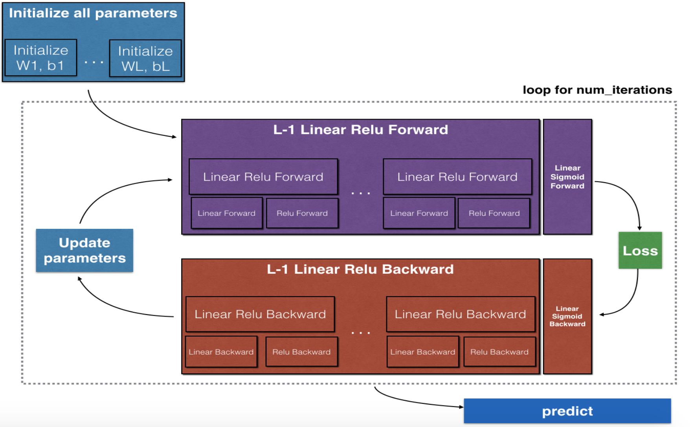

## Building your Deep Neural Network: Step by Step

### Objectives
* Use non-linear units like ReLU to improve your model. 
* Build a deeper neural network (with more than 1 hidden layer). 
* Implement an easy-to-use neural network class. 

### Notes

### Common Practice
* Initialize the parameters for a two-layer network and for an  LL -layer neural network.
* Implement the forward propagation module.
	* Complete the LINEAR part of a layer's forward propagation step.
	* We give you the ACTIVATION function (relu/sigmoid).
	* Combine the previous two steps into a new [LINEAR->ACTIVATION] forward function.
	* Stack the [LINEAR->RELU] forward function L-1 time (for layers 1 through L-1) and add a [LINEAR->SIGMOID] at the end (for the final layer  LL ). This gives you a new L_model_forward function.
* Compute the loss.
* Implement the backward propagation module.
	* Complete the LINEAR part of a layer's backward propagation step.
	* We give you the gradient of the ACTIVATE function (relu_backward/sigmoid_backward)
	* Combine the previous two steps into a new [LINEAR->ACTIVATION] backward function.
	* Stack [LINEAR->RELU] backward L-1 times and add [LINEAR->SIGMOID] backward in a new L_model_backward function
* Finally update the parameters.

