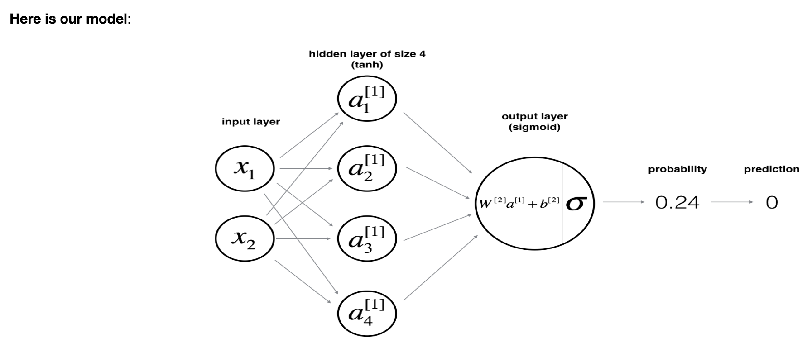
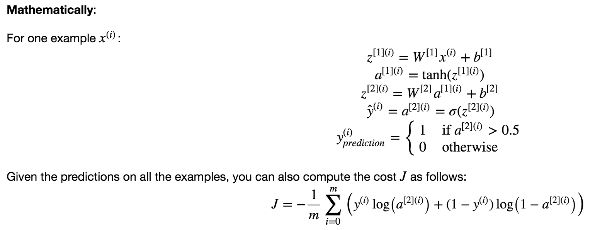

## Planar Data Classification with a Hidden Layer

### Objectives
* Implement a 2-class classification neural network with a single hidden layer.
* Use units with a non-linear activation function, such as tanh.
* Compute the cross entropy loss.
* Implement forward and backward propagation.

### Notes
1. An example of a shallow neural network: 
  
  
2. With overfitting: 
	* The larger models (with more hidden units) are able to fit the training set better, until eventually the largest models overfit the data.
	* The best hidden layer size seems to be around n_h = 5. Indeed, a value around here seems to fits the data well without also incurring noticable overfitting.
	* You will also learn later about regularization, which lets you use very large models (such as n_h = 50) without much overfitting.

### Common Practice
1. The general methodology to build a Neural Network is to:
	1. Define the neural network structure ( # of input units,  # of hidden units, etc). 
	2. Initialize the model's parameters
	3. Loop:
    	- Implement forward propagation
    	- Compute loss
    	- Implement backward propagation to get the gradients
    	- Update parameters (gradient descent)