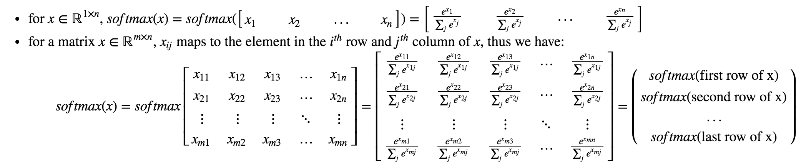
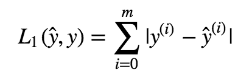
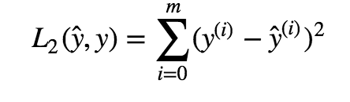

## Python Basics with NumPy assignment 

### Notes 
1. X.shape is used to get the shape (dimension) of a matrix/vector X.
2. X.reshape(...) is used to reshape X into some other dimension.
3. Another common technique we use in Machine Learning and Deep Learning is to normalize our data. It often leads to a better performance because gradient descent converges faster after normalization. 
	* `np.linalg.norm(...)`
4. softmax(x) is defined as 

5. `np.dot()` performs a matrix-matrix or matrix-vector multiplication. This is different from `np.multiply()` and the `*` operator (which is equivalent to `.*` in Matlab/Octave), which performs an element-wise multiplication.
6. L1 loss function: 

7. L2 loss function: 
 
