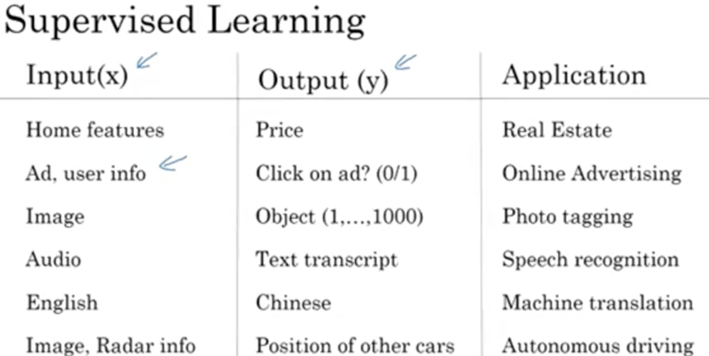
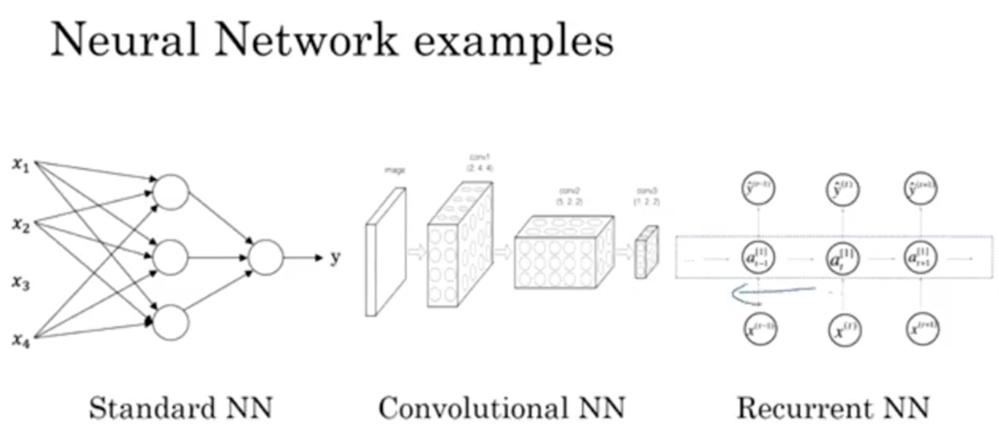
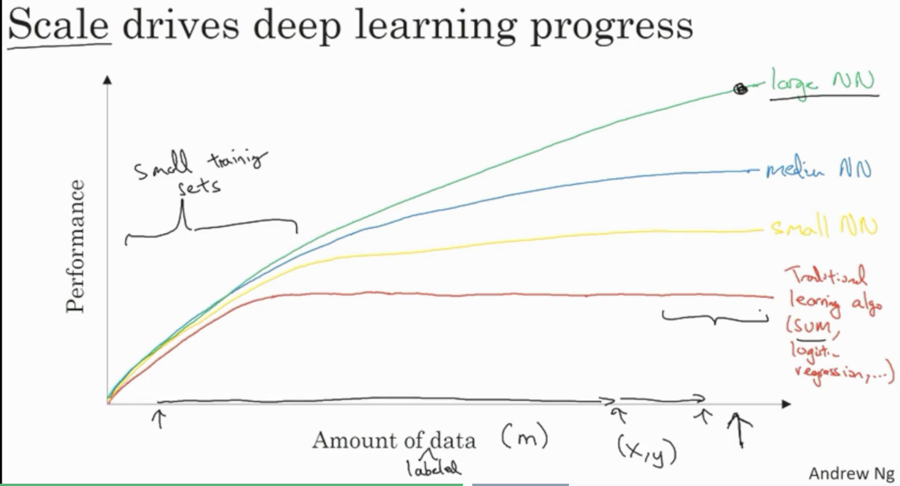

# Week 01: Intro to Deep Learning

## Learning Objectives 
* Understand the major trends driving the rise of deep learning.
* Be able to explain how deep learning is applied to supervised learning.
* Understand what are the major categories of models (such as CNNs and RNNs), and when they should be applied.
* Be able to recognize the basics of when deep learning will (or will not) work well.

## 0. Course Outline
1. Intro 
2. Basics of NN programming 
3. 1 hidden layer NN
4. Deep NN
 
### 1. What is Neural Network
* Figuring out a mapping between X & y. Mostly used in supervised learning. 
* Deep learning == training large neural network
* Single Neuron: applying linear function or non-linear function (a transformation)
* __ReLU__: Rectified Linear Unit - function that looks like _/.
* __Density Connected__: take all ouputs from the previous layer as inputs for this neuron. 

### 2. Supervised Learning with Neural Network
Examples:  

* Common Choices of NN: Standard NN (data science), __CNN__ (computer vision), __RNN__ (speech recognition, machine translation), or custom/hybrid NN (auto-driving cars).

* Structured Data: tabular databases 
* Unstructured Data: audio, image, text 

### 3. Drivers behind Deep Learning 
1. Large amount of labeled data. 
2. The ability to train large NN. (a.k.a. computional power) 
3. New Algorithms

* With a small amount of data, the order of performances of diff learning algorithms are not well-defined. 
* Activation function: move from sigmoid to ReLU because sigmoid function have extremely small slope on both ends -> learning to be slow but ReLU has a constant slope on the right half -> gradient constant -> learning more quickly converges. 
* Iterative Process: Idea -> Code -> Experiement -> Idea ...

## Weekly Bio: Geoffrey Hinton
* The "Godfather" of DL - a legend. 
* Backprop algorithms can learn wording connections - semantic meanings. 
* A.I. perspective Knowledge: how it relates to other concepts. 
* [Boltzmann Machine](https://en.wikipedia.org/wiki/Boltzmann_machine) 
* [Deep Belief Network](https://en.wikipedia.org/wiki/Deep_belief_network)
* [Variational Bayesian methods](https://en.wikipedia.org/wiki/Variational_Bayesian_methods)
* ReLU was almost extactly == a whole stack of logistic units. 
* [Deep Residual Networks](https://blog.waya.ai/deep-residual-learning-9610bb62c355)
* [Recirculation Algorithm](https://en.wikipedia.org/wiki/GeneRec) 
* [Spike-timing-dependent plasticity](https://en.wikipedia.org/wiki/Spike-timing-dependent_plasticity): the reverse of Recirculation Algo
* Capsule: partition the true representation into subsets. Capsule is able to represent an instance of a feature, but only 1. It represents all the different properties of the feature. 
* Routine by Agreement: given a capsule for a mouth & a capsule for a nose, let them vote for what parameters should be for a face. They are likely to agree. This will allow NN to generalize better. 
* Unsupervised Learning is going to be crucial. 
* [Generative Adversarial Networks](https://en.wikipedia.org/wiki/Generative_adversarial_network)
* If someone want to break into DL, what should they do? 
	1. read the papers but do not read too much of it. 
	2. notice something that you think everybody is doing wrong. 
	3. figure out how to di it right. 
	4. trust your intuitions. 
	5. replicate published papers -> discover all the tricks to make it work
	6. never stop programming 
	7. find an advisor who has the same beliefs. 
* new AI viewpoint: __thought__ == a big vector of neural activity (as opposed to a symbolic expression). 