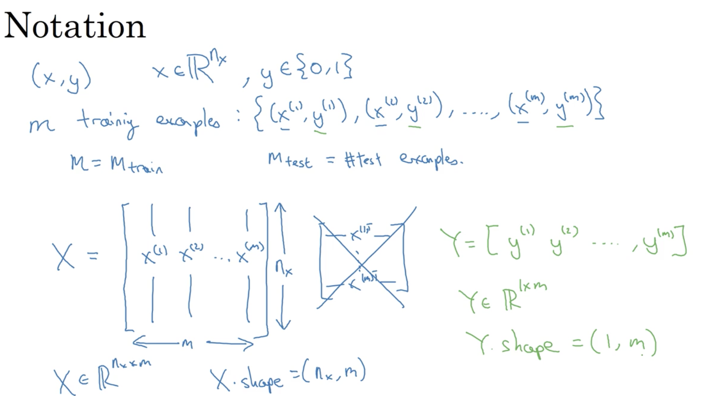

# Week 02: Neural Network Basics

## Learning Objectives 

* Build a logistic regression model, structured as a shallow neural network. 
* Implement the main steps of an ML algorithm, including making predictions, derivative computation, and gradient descent. 
* Implement computationally efficient, highly vectorized, versions of models.
* Understand how to compute derivatives for logistic regression, using a backpropagation mindset.
* Become familiar with Python and Numpy
Work with iPython Notebooks.
* Be able to implement vectorization across multiple training examples. 

### 1. Binary Classification 
* Unrolling image RGB info: X = RGM channels of the image unrolled in a long vector. 
* __notations__:  
 

### 2. Logistic Regression 
* __problem formulation__: the notation in red will not be used in this course.  

### 3. Logistic Regression Cost Function
* If to use the squared error loss function, the optimasation problem becomes non-convex (i.e. has multiple local minima). 
* __loss function__: for a single training example. 
* __cost function__: for the entire training set. 

### 4. Gradient Descent 
* __illustration__: 

* _alpha_: learning rate.
* _dw_: derivative term of w. 
* _db_: derivative term of b. 
* __gradient descent update__: 

### 5. Derivatives with Computation Graph
* one step of __backward__ propagation on a computation graph yields derivative of final output variable. 

