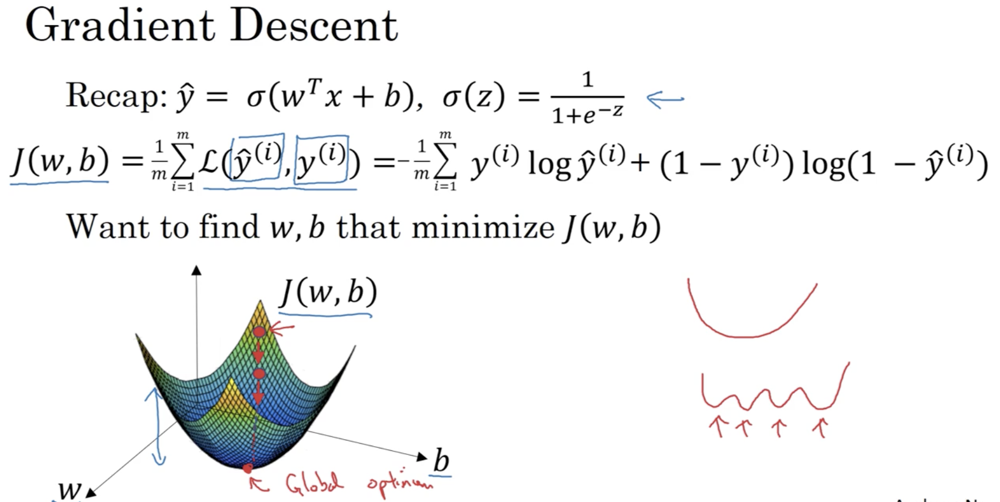

# Week 02: Neural Network Basics

## Learning Objectives 

* Build a logistic regression model, structured as a shallow neural network. 
* Implement the main steps of an ML algorithm, including making predictions, derivative computation, and gradient descent. 
* Implement computationally efficient, highly vectorized, versions of models.
* Understand how to compute derivatives for logistic regression, using a backpropagation mindset.
* Become familiar with Python and Numpy
Work with iPython Notebooks.
* Be able to implement vectorization across multiple training examples. 

### 1. Binary Classification 
* Unrolling image RGB info: X = RGM channels of the image unrolled in a long vector. 
* __notations__:  
 

### 2. Logistic Regression 
* __problem formulation__: the notation in red will not be used in this course.  

### 3. Logistic Regression Cost Function
* If to use the squared error loss function, the optimasation problem becomes non-convex (i.e. has multiple local minima). 
* __loss function__: for a single training example. 
* __cost function__: for the entire training set. 

### 4. Gradient Descent 
* __illustration__: 

* _alpha_: learning rate.
* _dw_: derivative term of w. 
* _db_: derivative term of b. 
* __gradient descent update__: 

### 5. Derivatives with Computation Graph
* one step of __backward__ propagation on a computation graph yields derivative of final output variable. 
* example: 

### 6. Logistic Regression Gradient Descent 
* __derivatives__: 

* on m examples: 

* try to avoid for loops to optimise efficiency. 

## Python & Vectorization 

### 1. Vectorization 
* Vectorization implementation runs faster when compared to for loops. 
* Whenever possible, avoid explicit for loops. 
* e.g. in Python
	* `np.dot(a,b)`
	* `np.exp(v)` 
	* `np.log(v)`
	* `v ** 2`
	* and more ...

### 2. Vectorizing Logistic Regression 
* forward propagation details: 

* single iteration of Logistic Regression (fw+bw): 

* for loop is still required for multiple iterations of the gradient descent algorithm. 

### 3. Broadcasting 
* e.g. in Python
	* `A.sum(axis=0)` 
	* `A / z.reshape(m, n)`
* Broadcasting examples: 
 
* [General Principles (doc)](https://docs.scipy.org/doc/numpy-1.13.0/user/basics.broadcasting.html)

### 4. Notes on Python/NumPy vectos
* prefer to specify the full dimensions (usually 2) of the matrices/vectors. 
* trick: `assert(a.shape == (6, 2)` to check the dimensions of a matrix
* convert rank 1 arrays to matrices: `a.shape(6, 2)`

### 5. Quick Tour of Jupyter Notebooks
* __Submit Assignment__ button is on the top right corner. 

### 6. Explnation on LR cost function
* __loss function__: 

* __cost function__: 

__under the assumption: training examples are i.i.d.__

## Weekly Bio: Pieter Abbeel

