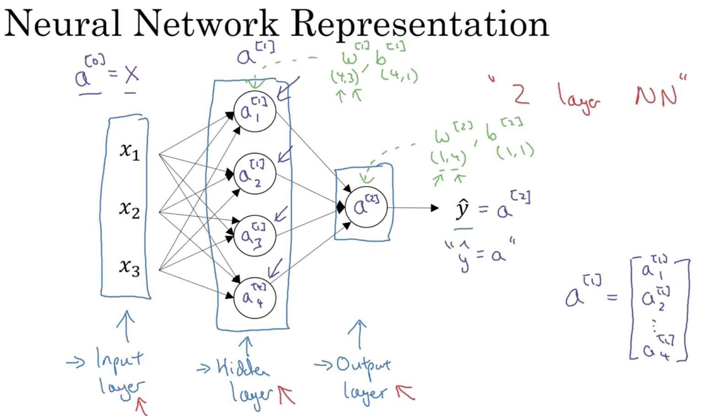
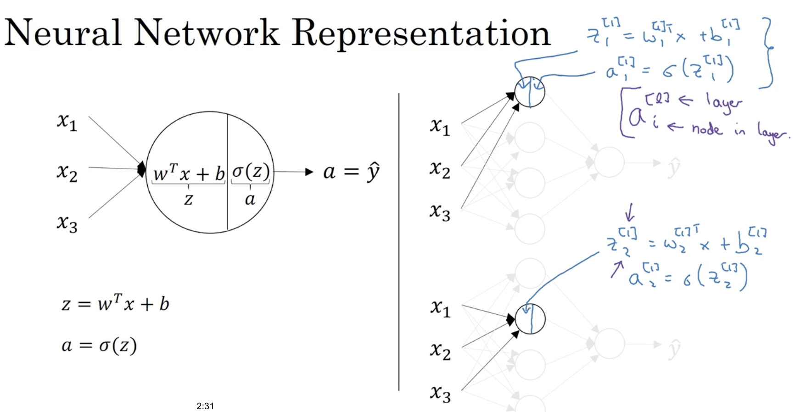
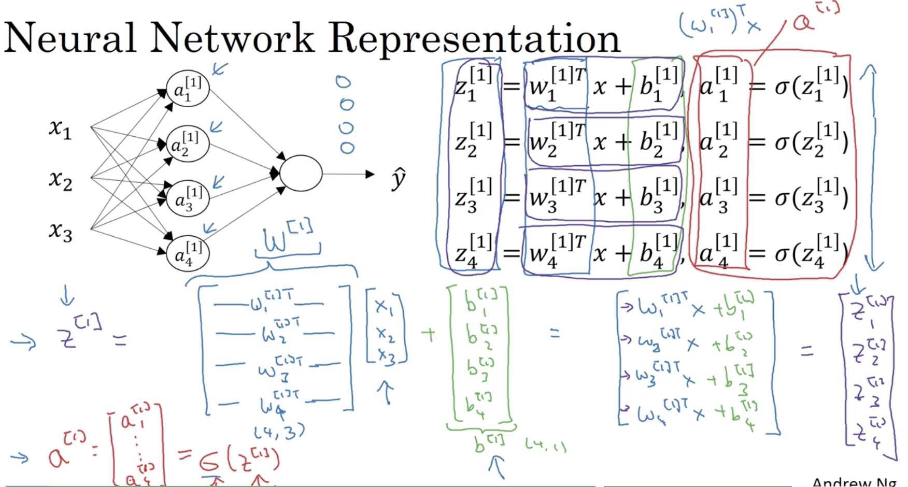
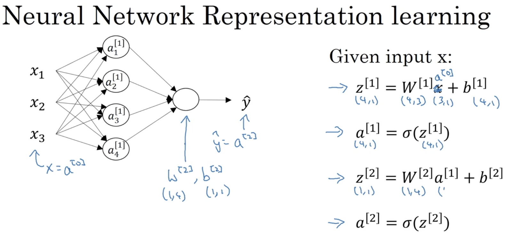

# Week 03: Shallow Neural Network

## Learning Objectives

* Understand hidden units and hidden layers
* Be able to apply a variety of activation functions in a neural network.
* Build your first forward and backward propagation with a hidden layer
* Apply random initialization to your neural network
* Become fluent with Deep Learning notations and Neural Network Representations
* Build and train a neural network with one hidden layer.

### 1. Neural Networks Basics
* __^[l]__: represents l-th layer. 
* logistic regression vs. neural network: 

* __hidden layers__: the values of those nodes are not in the training set. 
* notation & representation (e.g. 2 layer NN):

### 2. Neural Network Computation
*  Forward propagation for a single node: 

* Forward propagation for a layer: 

* Forward propagation for the entire NN: 

* Foward propagation multiple examples: 

 