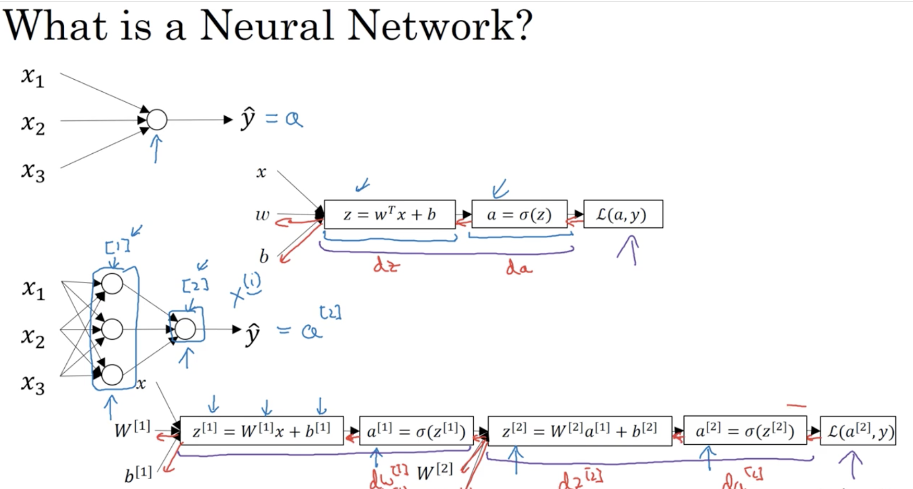
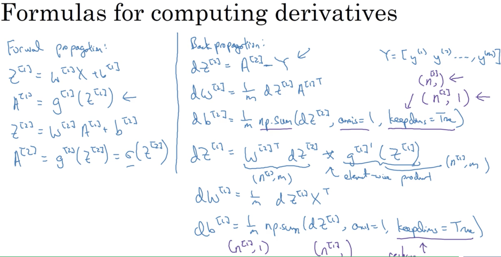

# Week 03: Shallow Neural Network

## Learning Objectives

* Understand hidden units and hidden layers
* Be able to apply a variety of activation functions in a neural network.
* Build your first forward and backward propagation with a hidden layer
* Apply random initialization to your neural network
* Become fluent with Deep Learning notations and Neural Network Representations
* Build and train a neural network with one hidden layer.

### 1. Neural Networks Basics
* __^[l]__: represents l-th layer. 
* logistic regression vs. neural network: 

* __hidden layers__: the values of those nodes are not in the training set. 
* notation & representation (e.g. 2 layer NN):

### 2. Neural Network Computation
*  Forward propagation for a single node: 

* Forward propagation for a layer: 

* Forward propagation for the entire NN: 

* Foward propagation multiple examples: 

	- A, Z matrices are (nx, m) where nx is the number of units in the next layer and m is the number of tranining examples. 
	- X is (# features, m)
* Implementation Details:  
  
  
	- b^[i] is added to each individual column. 

### 3. Activation Function
* activation functions: sigmoid(), tanh() - (this is far more better), ReLU(). 
* If the output is 0 or 1 (binary classification), __sigmoid__ is very natural for the output layer.
* __tanh__ is better than __sigmoid__.  
* __ReLU__ is the default option for hidden layer. 
* Examples: 

* why do we need non-linear activation functions?
	* if not, NN will be only computing a linear  function no matter how many hidden layers. 
	* hidden layers having all linear activation functions is also not useful. 

### 4. Derivatives of Activation Functions
* For __sigmoid__ fucntion: 
 
* For __tanh__ function: 
 
* For __ReLU__ function:
 

### 5. Gradient Descent for Neural Network
* Learning Framework: 
 
* Implementation details: 

_Assuming performing binary classification._
* Details of the backward propagation

### 6. Random Initialization 
* It is okay to initialise parameters to 0. But for neural network, is it important to randomly initialise parameters. 
* If initialising to all 0s, matrix W will cause nodes on the same layer to be the same in forward propagation and backward propagation, making nodes on the same layer completely symmetric. After iterations, hidden units are computing the same results again & again.
* It is common to initialise values in W matrix to small random numbers. Because if W is too large, you may end up on 2 ends of the activation function, which means learning would be slow.   
* However, it is okay to initialise b vector to be all 0s.  
* Practical Example:
 
 