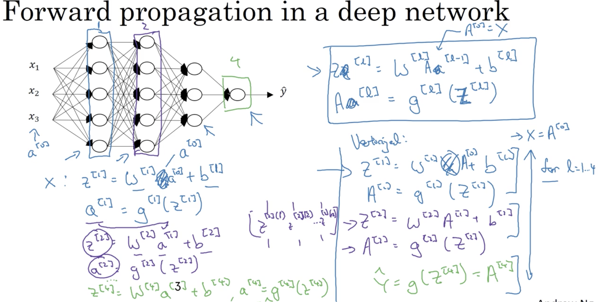
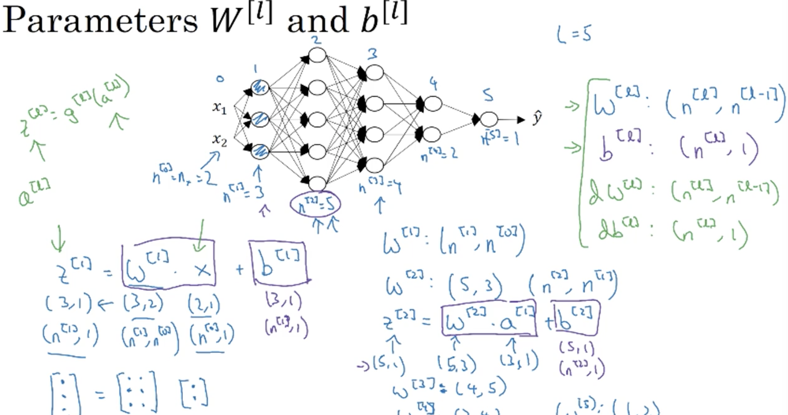
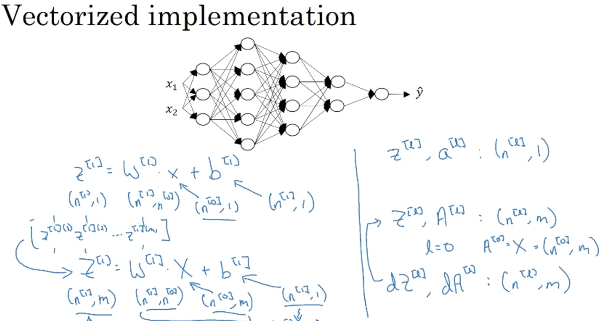
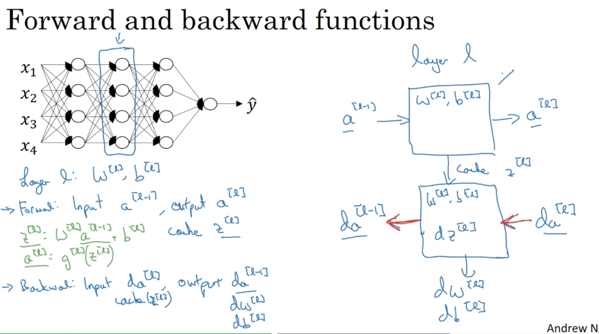
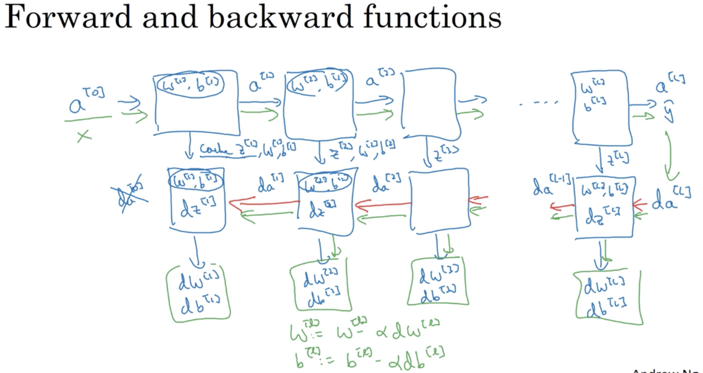
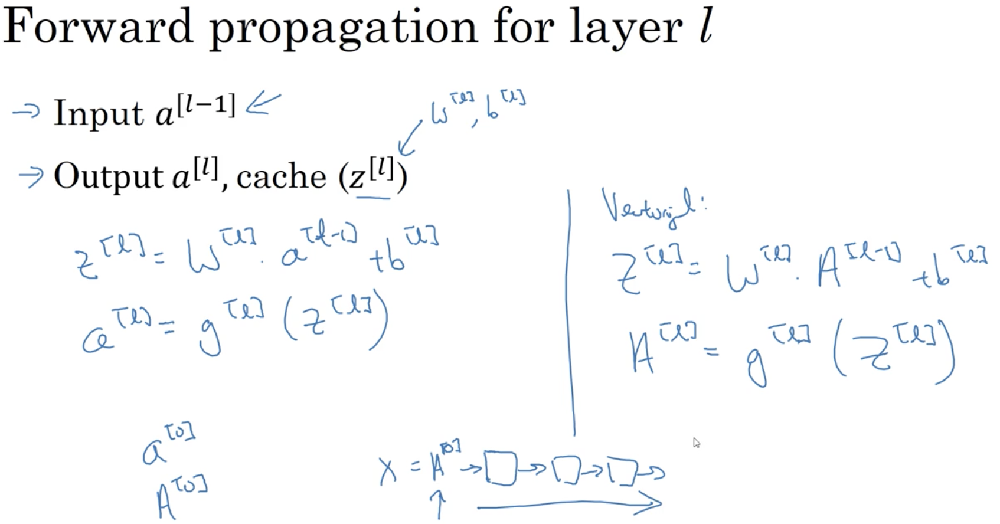
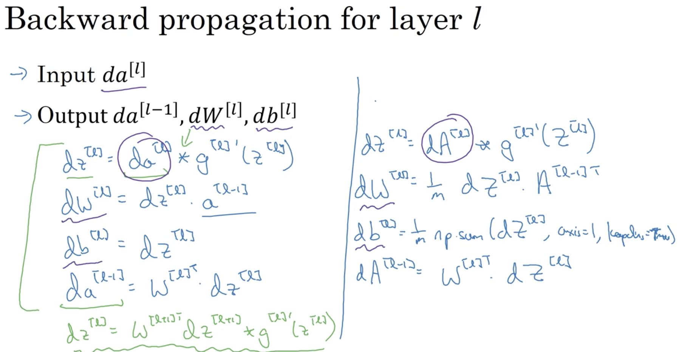
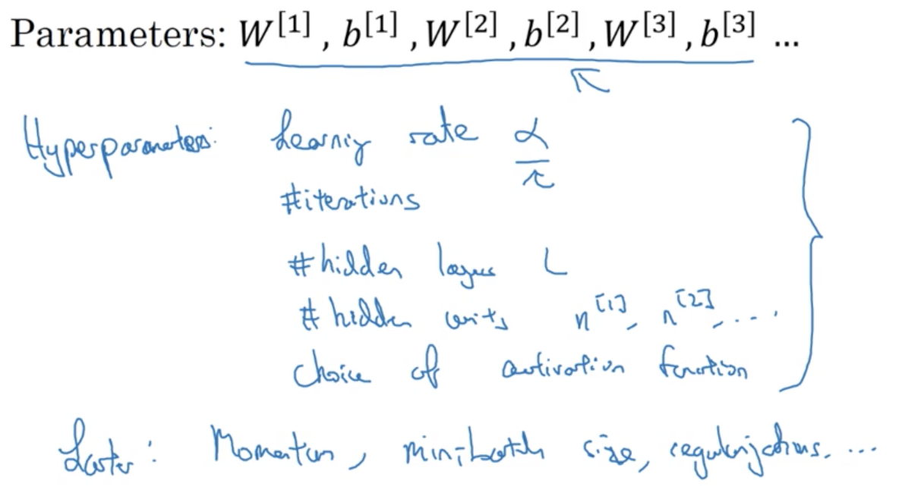

# Week 4: Deep Neural Network 

## Learning Objectives
* See deep neural networks as successive blocks put one after each other. 
* Build and train a deep L-layer Neural Network. 
* Analyze matrix and vector dimensions to check neural network implementations. 
* Understand how to use a cache to pass information from forward propagation to back propagation.
* Understand the role of hyperparameters in deep learning. 

### 1. Deep L-layer neural network 
* "deep" means many hidden layers. 
* __L__: number of layers.
* __n^[l]__: number of units in layer l.
* __a^[l]__: activations in layer l. 
* notes on notation: 

### 2. Forward Propagation in DNN
* Forward propagation on DNN: 

### 3. Ensure Matrix Dimensions are right 
* General Rule for 1 example: 

* General Rule for multi examples: 

### 4. Why Deep Network works 
* early layers learn the low-level, simple featiures and then they are put together in later layers to compose complex features. 
* __Circuit Theory__: (informally) small L-layer DNN requires shallower NN with _exponentially_ more hidden units to compute. 

### 5. Building Blocks of DNN
* Forward + Backward functions: 

* Whole Workflow: 

* Details of FW propagation function:

* Details of BW propagation function: 
 
* __da^[l]__: is based on the cost function (often it is -y/a+(1-y)/(1-a) ). 

### 6. Parameters & Hyperparameters
* what are parameters & hyperparameters: 

* try out diff values for the hyperparameters and see which ones perform the best in terms of the cost function. 

