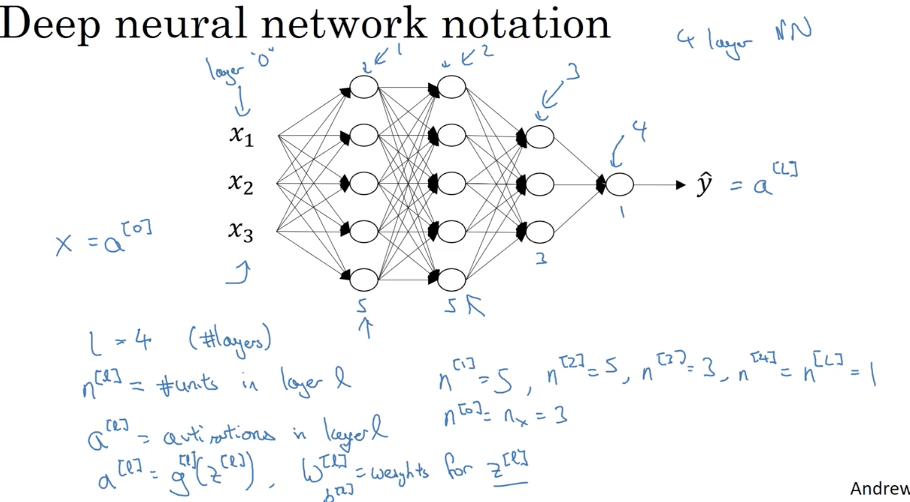

# Week 4: Deep Neural Network 

## Learning Objectives
* See deep neural networks as successive blocks put one after each other. 
* Build and train a deep L-layer Neural Network. 
* Analyze matrix and vector dimensions to check neural network implementations. 
* Understand how to use a cache to pass information from forward propagation to back propagation.
* Understand the role of hyperparameters in deep learning. 

### 1. Deep L-layer neural network 
* "deep" means many hidden layers. 
* __L__: number of layers.
* __n^[l]__: number of units in layer l.
* __a^[l]__: activations in layer l. 
* notes on notation: 

### 2. Forward Propagation in DNN
