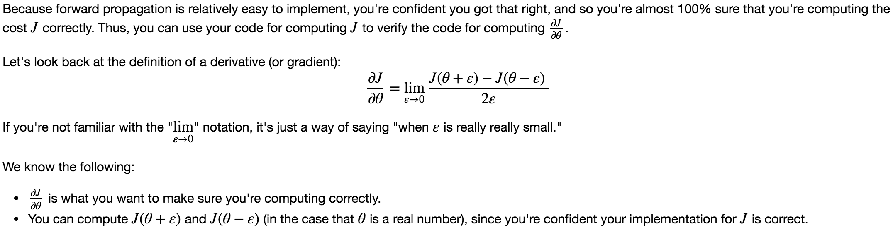
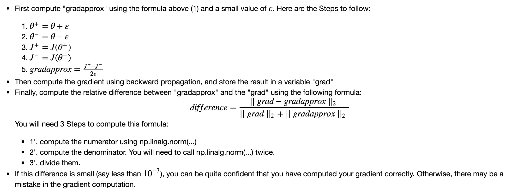
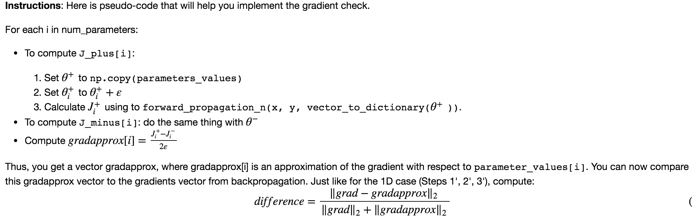

## Gradient Checking 

### Objectives
* Implement gradient checking from scratch.
* Understand how to use the difference formula to check your backpropagation implementation.
* Recognize that your backpropagation algorithm should give you similar results as the ones you got by computing the difference formula.
* Learn how to identify which parameter's gradient was computed incorrectly.

### Notes
* Definition of a Gradient

* Gradient checking verifies closeness between the gradients from backpropagation and the numerical approximation of the gradient (computed using forward propagation).
* Gradient checking is slow, so we don't run it in every iteration of training. You would usually run it only to make sure your code is correct, then turn it off and use backprop for the actual learning process.
* Gradient Checking, at least as we've presented it, doesn't work with dropout. You would usually run the gradient check algorithm without dropout to make sure your backprop is correct, then add dropout.

### Common Practice 
* Gradient Checking Instructions with 1 parameter: 
  
* Gradient Checking Instructions with multiple parameters: 
  
