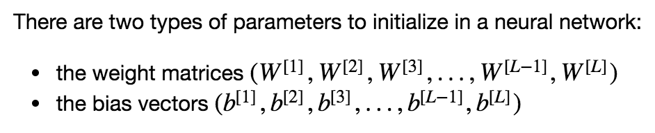

## Initialization 

### Objectives 
* Learn how different initializations lead to different results.

### Notes
* A well chosen initialization can:
	* Speed up the convergence of gradient descent.
	* Increase the odds of gradient descent converging to a lower training (and generalization) error.
* Parameters to be initialised: 

* Different initializations lead to different results. 
* Random initialization is used to break symmetry and make sure different hidden units can learn different things. 
* Don't intialize to values that are too large. 
* He initialization works well for networks with ReLU activations.

### Common Practice 
* Initialization methods:
	1. zero init: init parameters to all 0s. (this is really bad for neural networks since if used the neural net will not learn properly.)   
		* `np.zeros((x_dim, y_dim))`
		* _In general, initializing all the weights to zero results in the network failing to break symmetry. This means that every neuron in each layer will learn the same thing, and you might as well be training a neural network with  n[l]=1n[l]=1  for every layer, and the network is no more powerful than a linear classifier such as logistic regression._  
		* __The weights W[l] should be initialized randomly to break symmetry. It is however okay to initialize the biases b[l] to zeros. Symmetry is still broken so long as W[l] is initialized randomly.__
	2. random init: randomly init W matrices and leave bias vectors b to be 0s.
		* `np.random.randn(..,..) * scale`
		* _(with high init values) The cost starts very high. This is because with large random-valued weights, the last activation (sigmoid) outputs results that are very close to 0 or 1 for some examples, and when it gets that example wrong it incurs a very high loss for that example. Indeed, when log(a[3])=log(0), the loss goes to infinity. Poor initialization can lead to vanishing/exploding gradients, which also slows down the optimization algorithm. If you train this network longer you will see better results, but initializing with overly large random numbers slows down the optimization._
		* __Initializing weights to very large random values does not work well.
Hopefully intializing with small random values does better.__
	3. 'He' init: the scale in random init is now sqrt(2./layers_dims[l-1]).). 
		* `np.random.randn(..,..) * np.sqrt(2./layers_dims[l-1])`
		* __This works well with ReLU functions. Speed up the optimization learning process.__