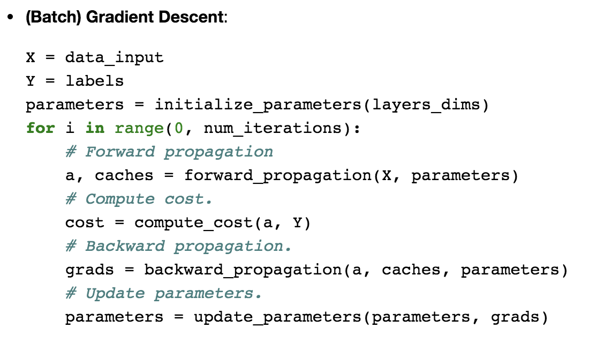
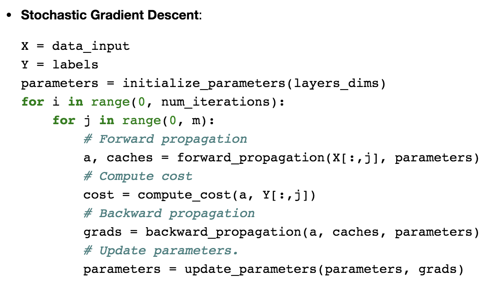
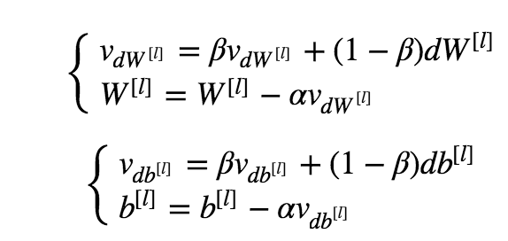
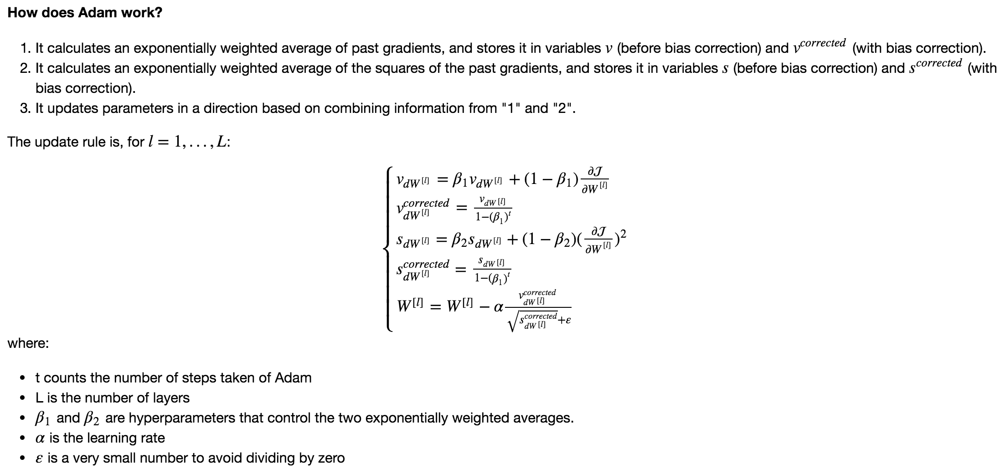

## Optimization 

### Objectives 
* Understand the intuition between Adam and RMS prop. 
* Recognize the importance of mini-batch gradient descent. 
* Learn the effects of momentum on the overall performance of your model. 

### Notes 
* In Stochastic Gradient Descent, you use only 1 training example before updating the gradients. When the training set is large, SGD can be faster. But the parameters will "oscillate" toward the minimum rather than converge smoothly.
* The difference between gradient descent, mini-batch gradient descent and stochastic gradient descent is the number of examples you use to perform one update step.
* You have to tune a learning rate hyperparameter α.
* With a well-turned mini-batch size, usually it outperforms either gradient descent or stochastic gradient descent (particularly when the training set is large).
* To build mini-batches from the training set: Shuffle & Partition
* Momentum takes into account the past gradients to smooth out the update.
* The momemtum terms are initialized with zeros. So the algorithm will take a few iterations to "build up" velocity and start to take bigger steps.
* If β=0 , then this just becomes standard gradient descent without momentum.
* The larger the momentum β is, the smoother the update because the more we take the past gradients into account. But if β is too big, it could also smooth out the updates too much.
* Common values for β range from 0.8 to 0.999. If you don't feel inclined to tune this, β=0.9 is often a reasonable default.
* Tuning the optimal β for your model might need trying several values to see what works best in term of reducing the value of the cost function J.
* Momentum usually helps, but given the small learning rate and the simplistic dataset, its impact is almost negligeable. Also, the huge oscillations you see in the cost come from the fact that some minibatches are more difficult thans others for the optimization algorithm.
* Adam on the other hand, clearly outperforms mini-batch gradient descent and Momentum. If you run the model for more epochs on this simple dataset, all three methods will lead to very good results. However, you've seen that Adam converges a lot faster.
* Some advantages of Adam include:
	* 1) Relatively low memory requirements (though higher than gradient descent and gradient descent with momentum). 
	* 2) Usually works well even with little tuning of hyperparameters (except α).

### Common Practice 
* Implementation Details for Batch Gradient Descent

* Implementation Details for Stochastic Gradient Descent

* Implementation Details for Momentum
 
_where L is the number of layers,  ββ  is the momentum and  αα  is the learning rate._
* Implementation Details for Adam

_note the same thing should be performed on b as well._
 
### Resource 
* [Paper on Adam](https://arxiv.org/pdf/1412.6980.pdf)

