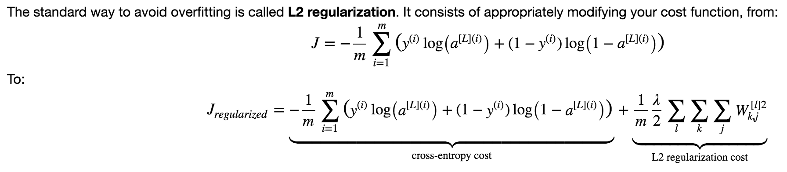
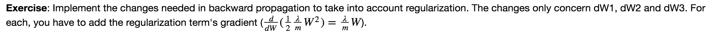
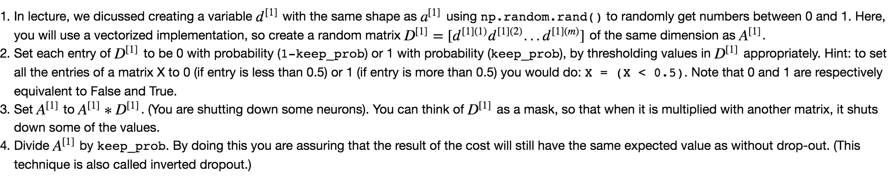
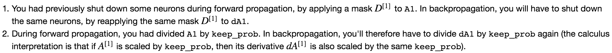

## Regularization

### Objectives 
* Understand that different regularization methods that could help your model.
* Implement dropout and see it work on data.
* Recognize that a model without regularization gives you a better accuracy on the training set but nor necessarily on the test set.
* Understand that you could use both dropout and regularization on your model.

### Notes
* __L2 Regularization__	
	* The value of λ is a hyperparameter that you can tune using a dev set.
	* L2 regularization makes your decision boundary smoother. If λ is too large, it is also possible to "oversmooth", resulting in a model with high bias (underfitting).
	* L2-regularization relies on the assumption that a model with small weights is simpler than a model with large weights. Thus, by penalizing the square values of the weights in the cost function you drive all the weights to smaller values. It becomes too costly for the cost to have large weights! This leads to a smoother model in which the output changes more slowly as the input changes.
* __Dropout__ (is a regularization technique)
	* It randomly shuts down some neurons in each iteration. The idea behind drop-out is that at each iteration, you train a different model that uses only a subset of your neurons. With dropout, your neurons thus become less sensitive to the activation of one other specific neuron, because that other neuron might be shut down at any time.
	* A common mistake when using dropout is to use it both in training and testing. You should use dropout (randomly eliminate nodes) only in training.
	* Deep learning frameworks like tensorflow, PaddlePaddle, keras or caffe come with a dropout layer implementation. Don't stress - you will soon learn some of these frameworks.
	* Apply dropout both during forward and backward propagation.
	* During training time, divide each dropout layer by keep_prob to keep the same expected value for the activations.
* _Note that regularization hurts training set performance! This is because it limits the ability of the network to overfit to the training set. But since it ultimately gives better test accuracy, it is helping your system._  

### Common Practice 
* __L2 Regularization__
	* cost function: 
  
	* gradient terms:

* __Dropout__
	* applied to forward propagation: 

	* applied to backward propagation: 
  