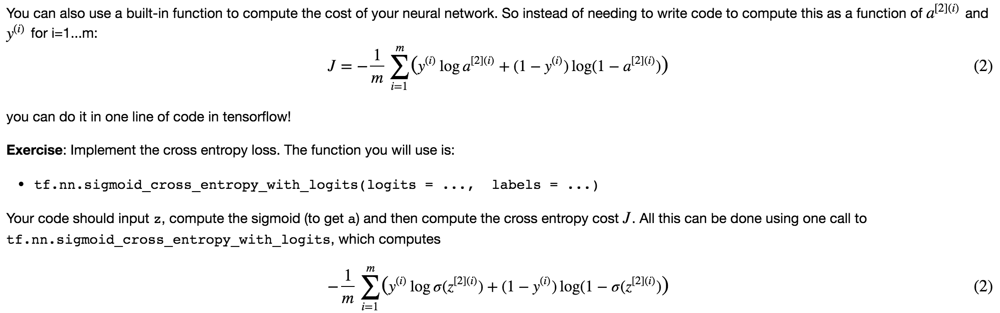
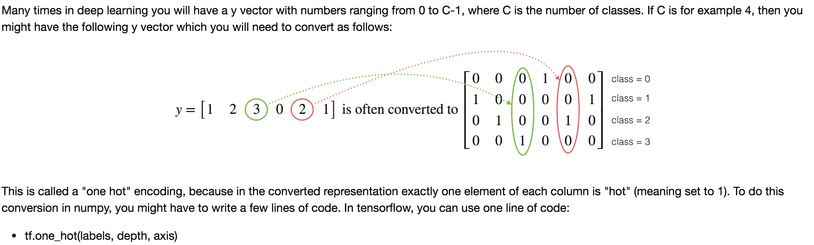

## TensorFlow

### Objectives 
* Learn all the basics of Tensorflow. 
	* Initialize variables
	* Start your own session
	* Train algorithms
	* Implement a Neural Network
* Implement useful functions and draw the parallel with what you did using Numpy. 
* Understand what Tensors and operations are, as well as how to execute them in a computation graph.
* Implement your own deep learning models using Tensorflow. 

### Notes
* Tensorflow is a programming framework used in deep learning
* The two main object classes in tensorflow are Tensors and Operators.
* When you code in tensorflow you have to take the following steps:
	* Create a graph containing Tensors (Variables, Placeholders ...) and Operations (tf.matmul, tf.add, ...)
	* Create a session
	* Initialize the session
	* Run the session to execute the graph
* You can execute the graph multiple times as you've seen in model()
* The backpropagation and optimization is automatically done when running the session on the "optimizer" object.

### Common Practice 
* Writing and running programs in TensorFlow has the following steps:
	1. Create Tensors (variables) that are not yet executed/evaluated.
	2. Write operations between those Tensors.
	3. Initialize your Tensors.
	4. Create a Session.
	5. Run the Session. This will run the operations you'd written above.
* Cross Entropy in TensorFlow

* Hot Encoding in TensorFlow
