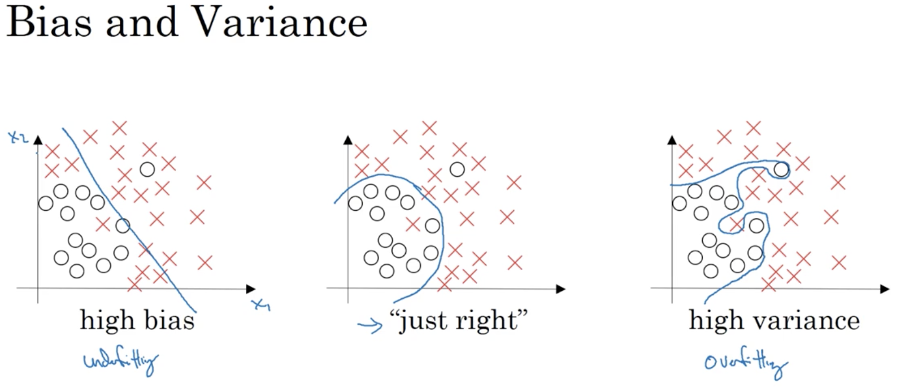
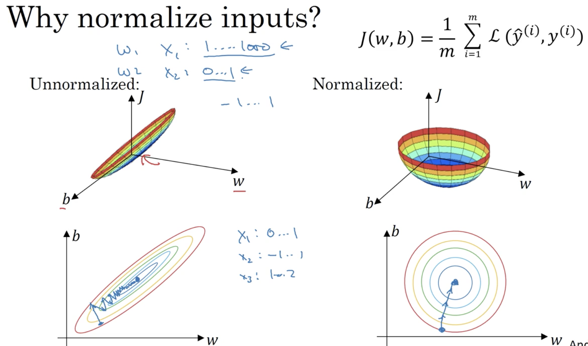
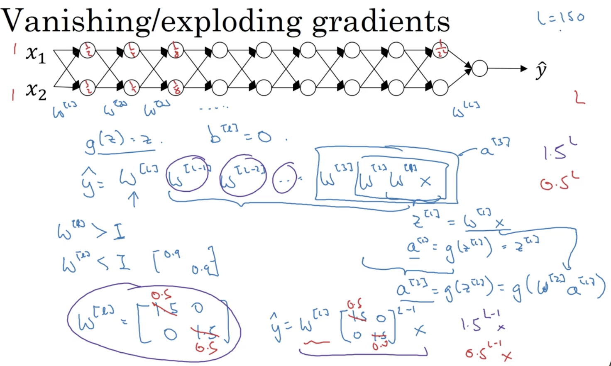
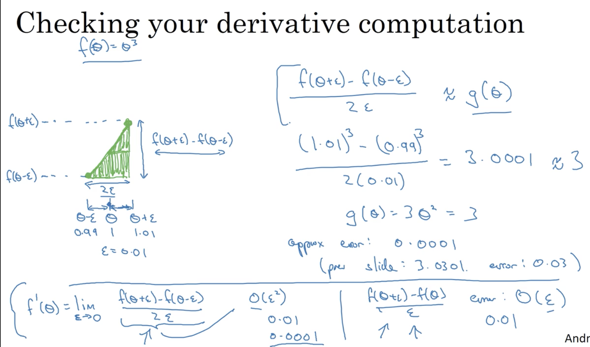
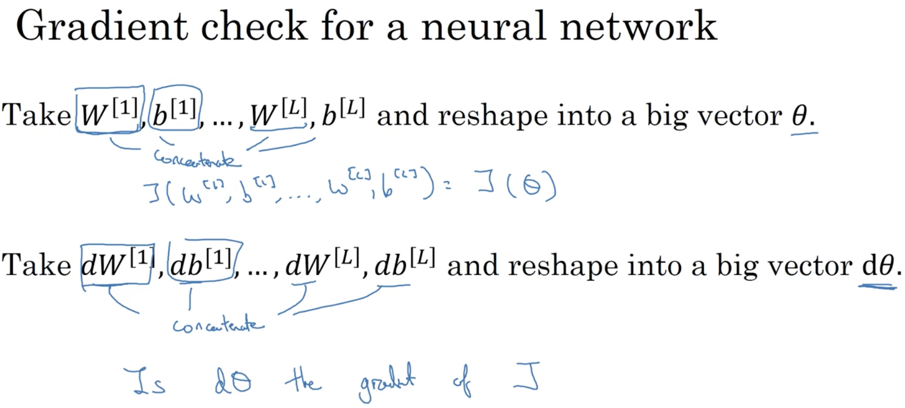
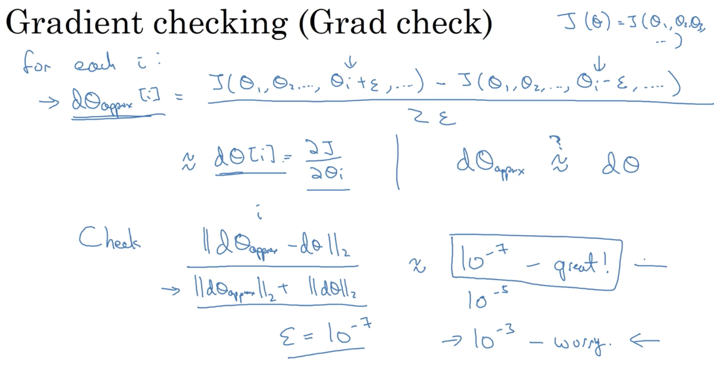

# Practical aspects of Deep Learning

## Learning Objectives 
* Recall that different types of initializations lead to different results. 
* Recognize the importance of initialization in complex neural networks.
* Recognize the difference between train/dev/test sets.
* Diagnose the bias and variance issues in your model.
* Learn when and how to use regularization methods such as dropout or L2 regularization.
* Understand experimental issues in deep learning such as Vanishing or Exploding gradients and learn how to deal with them. 
* Use gradient checking to verify the correctness of your backpropagation implementation. 

### 1. Train / Dev / Test sets 
* ML is a highly iterative process. 
* Intuition from one specific area (e.g. NLP, CV, and etc) often does not transfer very well to another field. 
* common splits for train/dev/test: 
	* for data size 100 to 10000: 70/30% (train/test) or 60/20/20%
	* for data size around 1000000 or above: 98/1/1%
* Mismatched train/test distribution: make sure dev & test sets come from the same distribution.
* Might be okay to not have a test set. (only dev set to choose the best model)

### 2. Bias / Variance 
* high bias == underfitting 
* high variance == overfitting 
* examples: 

_based on the assumption that optimal error is nearly to 0%_ 
* training error indicates high bias 
* dev (i.e. CV set) error indicates high variance
* high bias and high variance == in some regions it's high variance and in other regions it's high bias. 

### 3. Basic Recipe for ML
* In modern DL era, there is probably no trade-off between variance and bias, since you would have specific methods that only reduce one of them. 
* training a bigger neural network alomst never hurts. 
* the recipe for resolving high bias/variance issues: 

### 4. Regularization
* normally we omit 'b' value and only regularize 'w'.
* __weight decay__: A regularization technique (such as L2 regularization) that results in gradient descent shrinking the weights on every iteration. 
* __L2 regularization__:
	* for logistic regression: + lambda/(2m)*||w||^2
	* for neural network: + lambda/(2m) * sum(||w^[l]||^2 for all l) - "Frobenius norm"               
* __L1 regularization__:  + lambda/m * ||w||
* if using L1 regularization, 'w' will end up with a lot of 0s, which means it is sparse. 
* __lambda__: regularization parameter. It is usually decided by the CV set. 
* For gradient descent: dw[l] += lambda/m*w[l]

### 5. Why regularization prevent overfitting 
* most of the 'w' weight will be close to 0, which simplifies the neural network in some way (reduce the impacts of those neurons). 
* every layer will be roughly linear -> the whole neural network will be roughly close to a linear function -> model not too complex.  

### 6. Dropout Regularization 
* go through each layer and set a probablity to drop out or to reserve a neuron in that layer. Then, remove the incoming and outgoing links associated with that neuron, leading to a smaller network. 

* __Implementation Details ("Inverted Dropout")__: (core: zero out corresponding parameters)  
  
_Note: the last step is to not reduce the expected value of 'A' matrix._
* on different iterations of gradient descent, different batch of neurons will be zero out. The same training example will have different dropouts on different iterations.  
* no dropout when testing (i.e. making predictions)

### 7. Understanding Dropout 
* __Intuition__: cannot rely on any 1 feature, so have to spread out weights. 
* It is also feasible to vary keeping probablity on diff layers of the neural network. _Bigger parameter matrix == lower keeping probablity._ 
* In practice, it is not very often to have dropout on input layer. 
* In Computer Vision (since the input size is so big - pixels & do not have enough data), dropout is a common option. 
* the cost function J is not well-defined, so can't plot J to confirm decreasing nature of gradient descent.

### 8. Other regularization methods
* __Data augmentation__:
	* transformation of images
		* flipping horizontally 
		* random cropping
		* random distortion 
		* random rotation
* __Early Stopping__: 
	* plot training error or the cost J and the dev set error vs. number of iterations
	* pick a point which performs relatively well on both curves.  
  
	* __good-side__: no need to try out a bunch of lambda values (in L2 regularization)
	* __down-side__: couples the following 2 tasks
		* optimise cost function J
		* Ensure the model doesn't overfit
	* It's better to perform those tasks in order.

### 9. Normalizing Inputs
* __how__: subtract the mean and then divided by variance. 
* use the same mean/variance to normalise your testing set. 
* __why__: speed up the gradient descent.

### 10. Vanishing / Exploding Gradients 
* if we have a deep neural network the value of y will explode (if parameters > 1). Conversely, if parameters < 1, value of y will be extremely small.  
__Example:__

* This will make training difficult. 
* __Solution__: random weight initialization * a number that diminish the weights. 
	1. for ReLU: `W[l] *= np.sqrt(2/n[l-1])`
	2. for tanh: `W[l] *= np.sqrt(1/n[l-1])` (Xavier initialization)
	3. another option: `W[l] *= np.sqrt(1/(n[l-1]+n[l]))` 

### 11. Gradient Checking 
* the better (more accurate) way of approximating gradient: 
 
* __implementation details__: 
	* reshape & concatenate into big vector
	
	* compute approx & euclidean distance
	
	* only use gradient checking when debugging your code. 
	* if algorithm fails grad checking, look at individual components (which layer / db or dW) to try to identify bug. 
	* remember to add your regularization terms. 
	* gradient checking does not work with dropout. __Turn off dropout first to ensure gradients are correct, then use dropout to training.__ 
	* very rarely, the back prop might work when W, b closer to 0 but inaccurate when W, b are away from 0. _solution_: run grad checking at random init and then run the training for a while. Later, run the grad checking again to see if the back prop is correct. 

	
## Weekly Bio: Yoshua Bengio
* ReLU is working a lot better than sidmoid & tanh activation functions. 
* Using Neural Nets to tackle the curse of dimensionality.
* [Word Embedding](https://en.wikipedia.org/wiki/Word_embedding)
* [Vanishing gradient](https://en.wikipedia.org/wiki/Vanishing_gradient_problem)
* Supervised Learning is the industrial centre.
* Unsupervised Learning ==  understanding concepts by interaction and observation. 
* Unsupervised Learning is trying to learn a good representation. But defining "a good representation" is difficult, which leads to a range of challenges. 
* Research opportunity: a bot to understand the world (could be a virtual world e.g. a video game) by learning from observations & interactions in an autonomous way.  
* Doing research: what questions should we ask that allows us to better understand the phenomenon interested and the algorithms. 
* __Advice on getting into AI/DL__:
	* practice (programming) is the key. 
	* implement things yourself & understand what's going on. 
	* try to derive things from first principles. 
	* reading papers and other people's code. 
	* Do not be afraid of the maths. 
* Book: [Deep Learning by Yoshua Bengio](http://www.deeplearningbook.org/)

