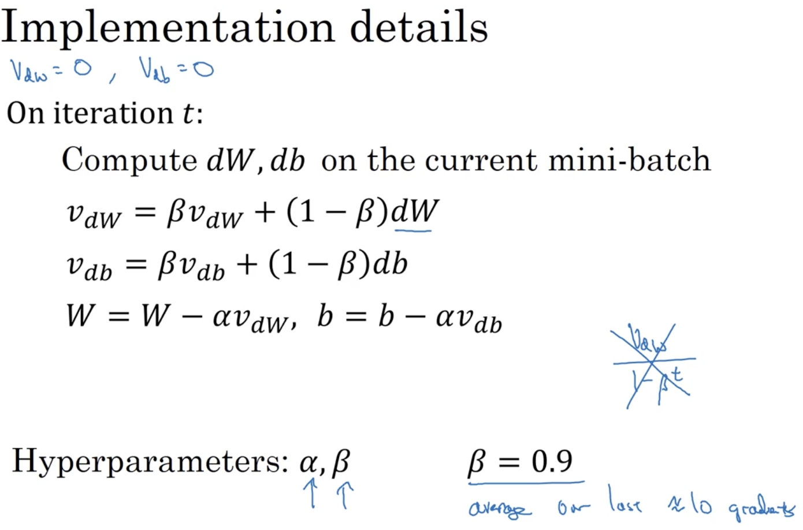
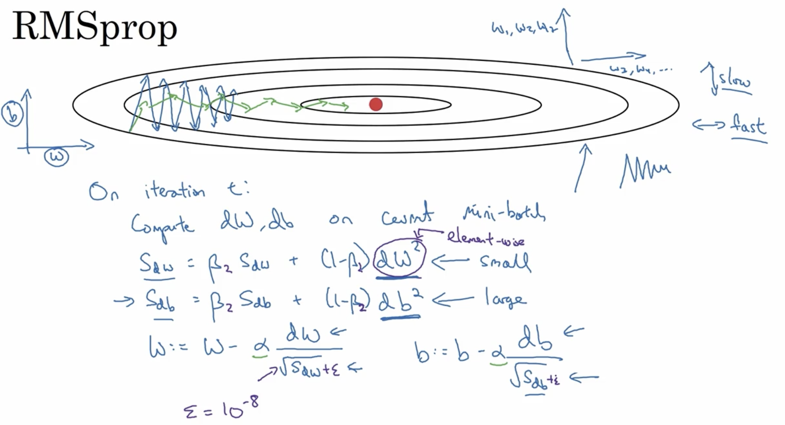
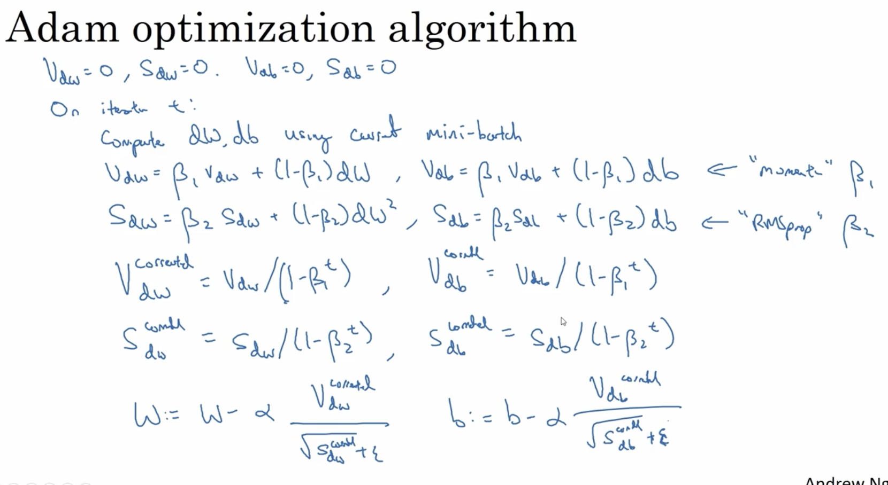
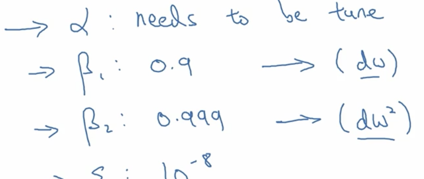
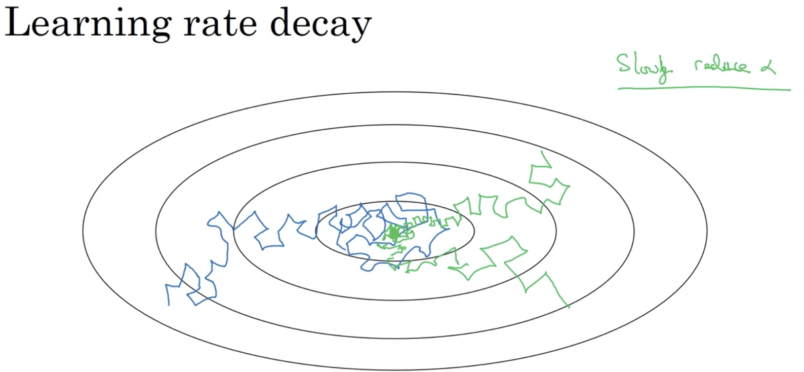
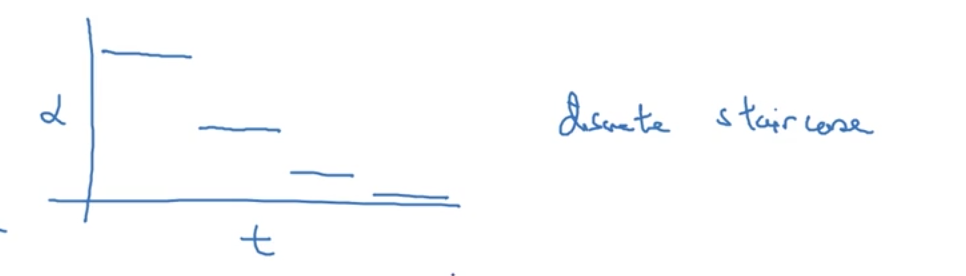
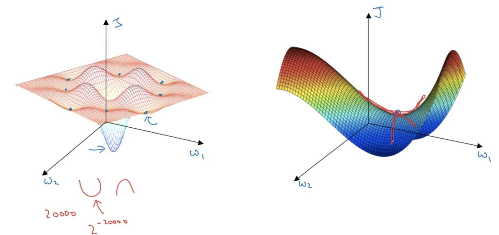
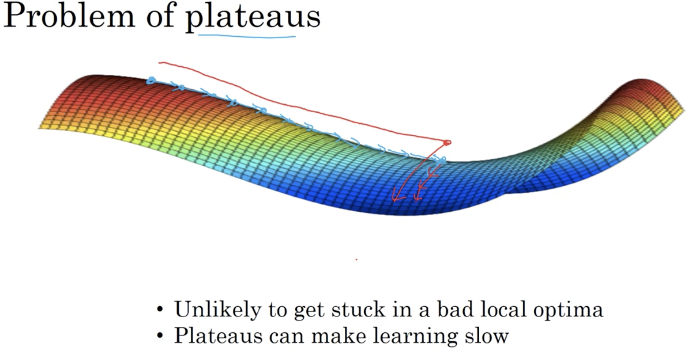

# Optimization Algorithms 

## Learning Objectives
* Remember different optimization methods such as (Stochastic) Gradient Descent, Momentum, RMSProp and Adam. 
* Use random minibatches to accelerate the convergence and improve the optimization. 
* Know the benefits of learning rate decay and apply it to your optimization. 

### 1. Mini-batch Gradient Descent
* mini-batch

* mini-batch implementation 
  
* the cost function plot

* mini-batch size: 
	* == m: it's just batch gradient descent. (_disadv: too long per iteration_)
	* == 1: stochastic gradient descent. (_disadv: lose speedup from vectorization_) 
	* == not too big & not too small in pratice. 
* how to choose mini-batch size?
	* if m <= 2000, then use batch gradient descent. 
	* otherwise, choose mini-batch size to be 64, 128, 256, 512 (or 1024). 
	* make sure the whole mini-batch fits in CPU/GPU memory. 

### 2. Exponentially weighted averages
* formula

 
	* if the window is too large, the curve is smoother but shifted further to the right. 
	* Increasing β will shift the red line slightly to the right. (green curve)
	* Decreasing β will create more oscillation within the red line.
* insight
 
* this is a very memory-efficient way of computing moving weighted averages. 
* implemetation details
 
* __bias correction__: change the initial behavior of the computation when there is no previous data starting from the first few examples.  

* In ML, most of the time, people do not bother to implement bias correction. Just wait until it wears off. 

### 3. Gradient Descent Momentum
* implementation details: 
 
* this will almost guaranteed to work better than the basic gradient descent.  (speed up)

### 4. RMSprop
* intuition: speed up on the sparse dimension & slow down on the dense dimension. 
* implemetation details:

* epsilon is there to ensure not dividing by 0. 

### 5. Adam Optimization Algorithm 
* taking the ideas of momentum & RMSprop & bias correction. 
* implemetation details:
 
* hyperparameters choices: 
 

### 6. Learning Rate Decay 
* intuition: slowly reduce your learning rate. If not reduced, mini-batch gradient descent will wadering around the minimum. 
 
* __epoch__: a pass through the entire training set. 
* learning rate decay examples: 
	* `alpha = alpha0 / (1 + decay_rate * epoch_num)`
	* exponentially decay: `alpha = alpha0 * beta^epoch_num where beta < 1`
	* `alpha = alpha0 * k/sqrt(epoch_num)`
	* `alpha = alpha0 * k/sqrt(t) where t is the iteration number of mini-batch gradient descent`
	* discrete staircase decay:
	 
	* or manual decay

### 7. Local Optima ?  
* In high dimensional spaces, it is more likely to find saddle points (derivative == 0 also) on the right than an actual global minimum. 

* problem of plateaus: nearly flat regions -> slows down the learning 

## Weekly Bio: Yuanqing Lin
* 1st ever winner of ImageNet Challenge (computer vision).
* Advice for entering AI/ML: 
	* open-source resource/framework
	* learn the basics
	