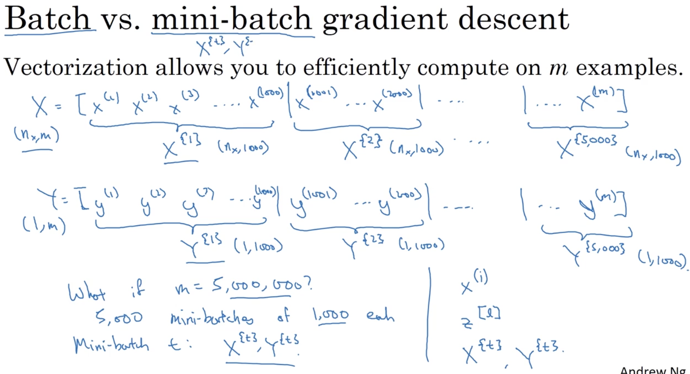
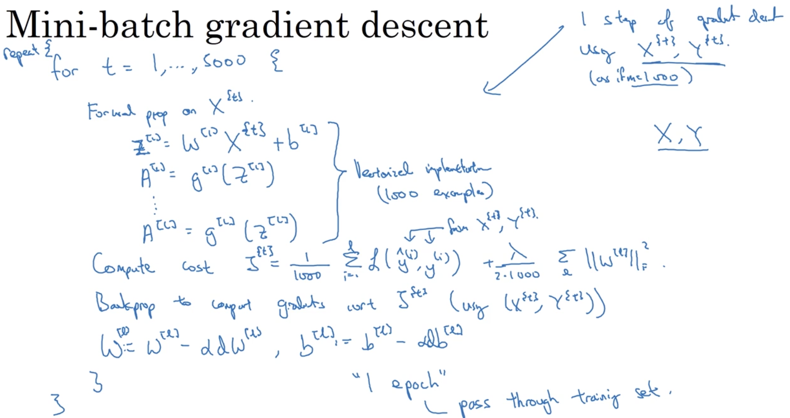
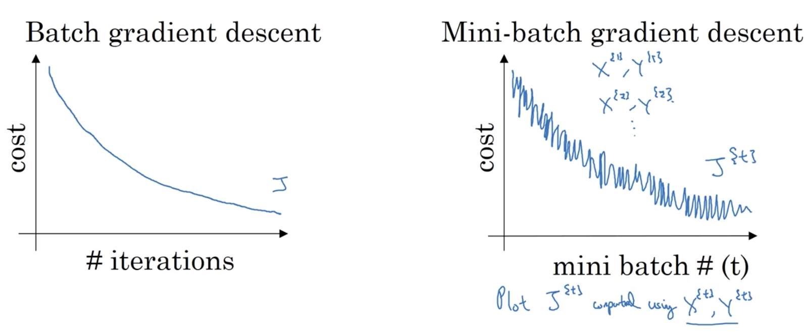
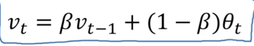
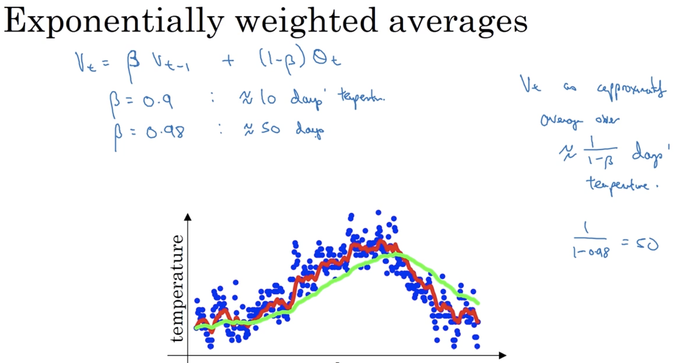
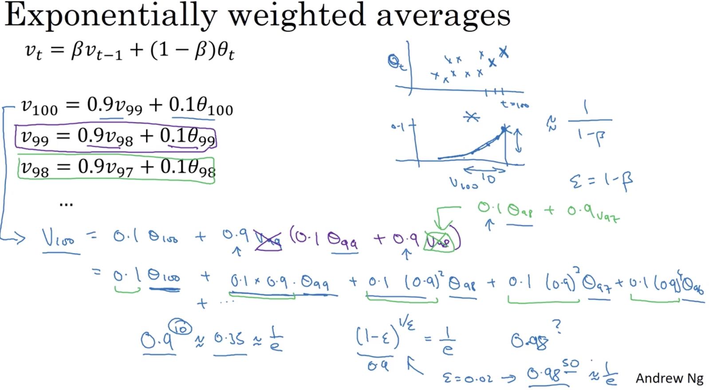
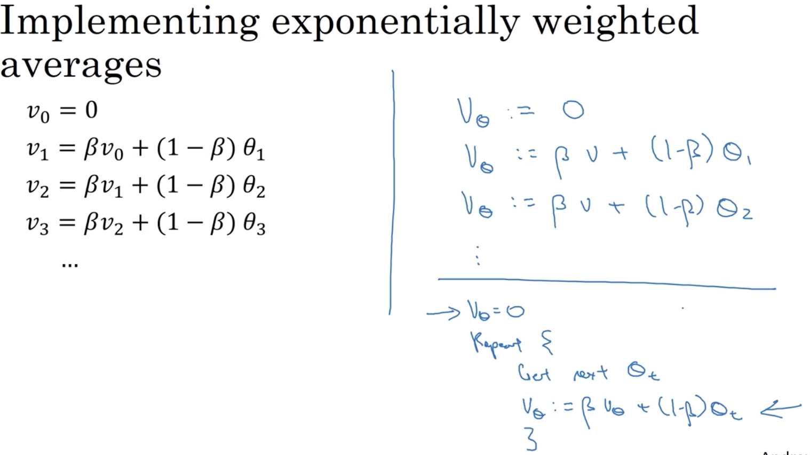
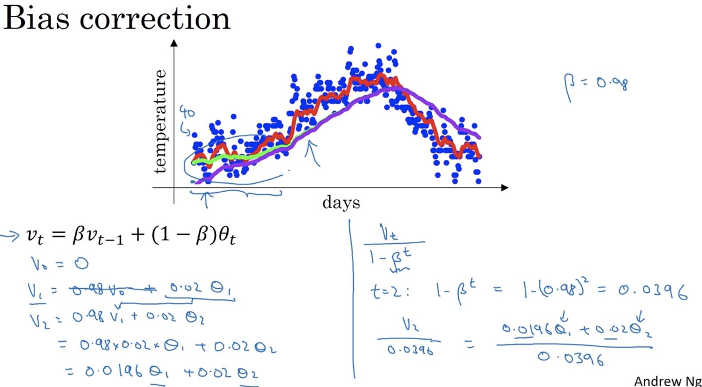

# Optimization Algorithms 

## Learning Objectives
* Remember different optimization methods such as (Stochastic) Gradient Descent, Momentum, RMSProp and Adam. 
* Use random minibatches to accelerate the convergence and improve the optimization. 
* Know the benefits of learning rate decay and apply it to your optimization. 

### 1. Mini-batch Gradient Descent
* mini-batch

* mini-batch implementation 
  
* the cost function plot

* mini-batch size: 
	* == m: it's just batch gradient descent. (_disadv: too long per iteration_)
	* == 1: stochastic gradient descent. (_disadv: lose speedup from vectorization_) 
	* == not too big & not too small in pratice. 
* how to choose mini-batch size?
	* if m <= 2000, then use batch gradient descent. 
	* otherwise, choose mini-batch size to be 64, 128, 256, 512 (or 1024). 
	* make sure the whole mini-batch fits in CPU/GPU memory. 

### 2. Exponentially weighted averages
* formula

 
	* if the window is too large, the curve is smoother but shifted further to the right. 
* insight
 
* this is a very memory-efficient way of computing moving weighted averages. 
* implemetation details
 
* bias correction: change the initial behavior of the computation when there is no previous data starting from the first few examples.  

* In ML, most of the time, people do not bother to implement bias correction. Just wait until it wears off. 

### 3. 