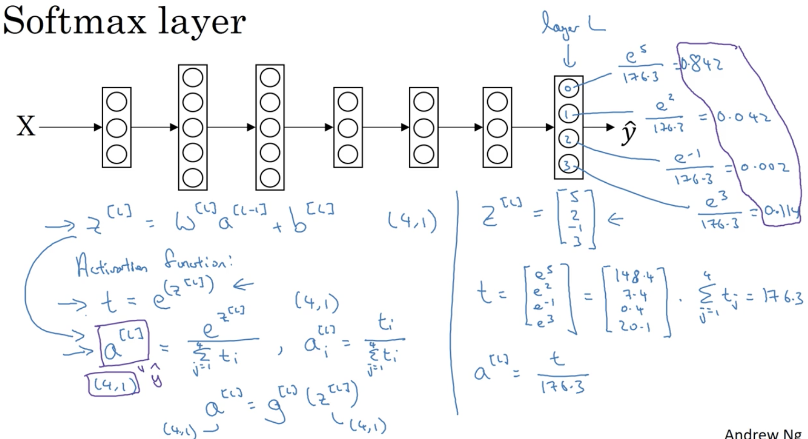

# Hyperparameter Tuning, Batch Normalization and Programming Frameworks

## Learning Objectives 
* Master the process of hyperparameter tuning. 

### 1. Hyperparameter Tuning 
* a list of hyperparameters to consider: 
	* learning rate: alpha
	* momentum term: beta
	* for adam: beta1, beta2, epsilon
	* num of layers 
	* num of hidden units 
	* choice of learning rate decay
	* mini-batch size 
* priorities for those hyperparameters:

	* _red_: high
	* _yellow_: medium
	* _purple_: low
* How to find hyperparameter values: 
	* try random value combinations for the hyperparameters in certain ranges (definitely not uniform distribution on real numbers)
	* coarse to find scheme: sample more densely in a particularly promising region
* Pick the scale for hyperparameters 
	* for discrete hyperparameters (uniformly random): 
	
	* for continuous hyperparameters (on a log scale): 
	
	* for beta (on a minus log scale):
	 
	
### 2. Organization of Hyperparameter Tuning 
* Babysitting one model: patiently configuring the hyperparameter values as days go by if you do not have enough computational resource. 
* Training many models in parallel if you have many computational power.   
 

### 6. Softmax Regression
* multi-class classification 
* softmax example: 
 
* __softmax layer L__
 
* __hard max__: produce a vector that only contains a 1 and all 0s for others. 
* __loss & cost function__
 
* Gradient Descent: back prop for this softmax is `Y_hat - Y`. 

### 7. Deep Learning Frameworks 
 

### 8. TensorFlow
* a simple optimization example: 
	* to optimise: J(w) = w^2 - 10w + 25
	 
	* _for cost_: you can use normal math formula. 
	* more specific example: 
		 
	* 2 ways of constructing common session scheme:
	  