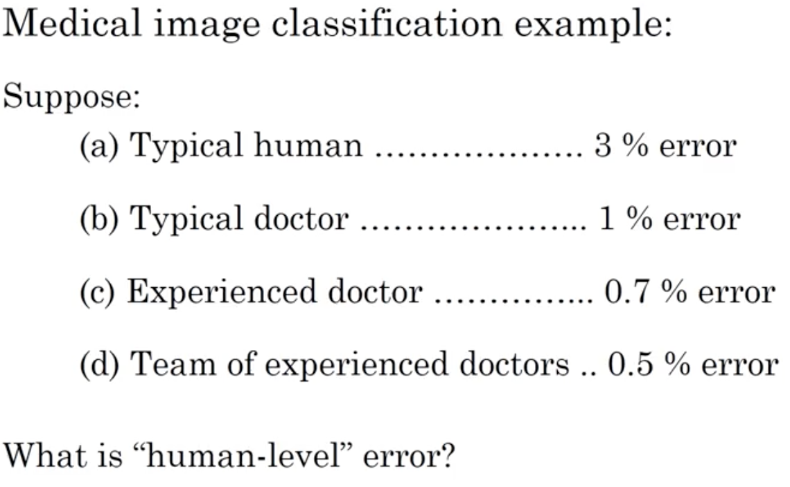

# ML Strategy - 1  

## Learning Objectives
* Understand why Machine Learning strategy is important. 
* Apply satisficing and optimizing metrics to set up your goal for ML projects. 
* Choose a correct train/dev/test split of your dataset. 
* Understand how to define human-level performance. 
* Use human-level perform to define your key priorities in ML projects. 
* Take the correct ML Strategic decision based on observations of performances and dataset. 

### 0. Motivation
* When improving a ML system, you might have a lot of ideas/directions. 

### 1. Orthogonalization
* Orthogonal controlling makes it easier to tune things to the way you wanted. 
* Chain of Assumptions in ML  
  
	* _Hopefully, tune distinctive features of the ML system under each assumption._
	* _Normally, don't consider early stopping because it affects training set and dev set performance at the same time._

### 2. Single Number Evaluation Metric
* To combine Precision & Recall, one can use F1 score. 

* The other option is the average. 

### 3. Satisficing and Optimizing metric
* _examples:_ maximise accuracy subject to runningTime <= 100ms
 

### 4. Train/Dev/Test Sets
* Randomly shuffle data coming from different distributions into dev/test sets. 
* __Guideline__
 
* Splitting Data
  
_Depending on the size of the data._
* Size of Test Set
  

### 5. When to change dev/test sets & metrics
* Situation arises when metric + dev performance favors 1 algorithm while the users/company prefers another algorithm. 

* If doing well on your metric + dev/test set does not correspond to doing well on your application, change your metric and/or dev & test set. _Example:_ high resolution cat images while training but users upload blurry, distorted cat images. 

### 6. Human-level performance 
* ML system performance when comparing to human-level performance

* Often, we use human-level error as a proxy for Bayes Error. 
* how to choose human-level error: 
 
 
_Use 0.5% - the best available human-level error when training error & dev error are small & close._

### 7. Avoidable bias
* [Bayes Error](https://en.wikipedia.org/wiki/Bayes_error_rate): lowest possible error rate for any classifier of a random outcome (into, for example, one of two categories) and is analogous to the irreducible error. 
* Avoidable Bias: 
 

### 8. Surpassing human-level performance

### 9. Improving your model performance
* 2 fundamantal assumptions of supervised learning

* reducing bias & variance
 

## Weekly Bio - Andrej Karpathy
* ImageNet: human benchmark. 
* General Feature extrator generating from large training datasets. 
* [Transfer Learning](https://en.wikipedia.org/wiki/Transfer_learning) 
* Unsupervised Learning is still not very obvious in terms of its applications. 
* Single neural network that's completely dynamical with a full agent. _Question: how to formalise the objectives so that we can get intelligent behaviours out._ 
* [Short Story on AI: A Cognitive Discontinuity](http://karpathy.github.io/2015/11/14/ai/)
* Advice on entering AI: 
	* full understanding of the lower-level implementations. 
