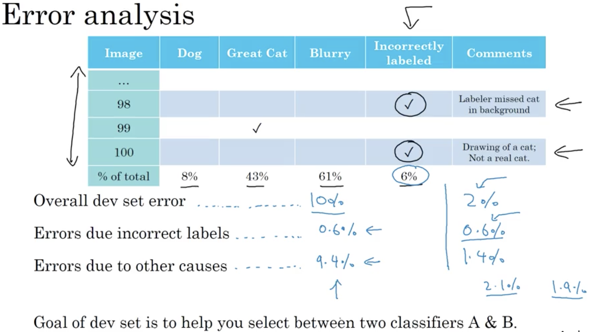

# ML Strategy - 2

## Learning Objectives 
* Understand what multi-task learning and transfer learning are. 
* Recognize bias, variance and data-mismatch by looking at the performances of your algorithm on train/dev/test sets. 

### 1. Error Analysis 
* estimating the ceiling on different ideas

 
* cleaning up incorrectly labeled data

_if it's systematic errors, then it will be an issue for the DL algorithm. e.g. consistently incorrectly label lions as cats._
* if the incorrectly labeled data are in dev set, add another colomn in the error analysis  

* advice on correcting incorrect samples

* build your first system quickly, then iterate

### 2. Mismatched training and dev/test set
* Training and Testing on Different Distributions

* Bias and Variance with mismatched data distributions
	* _issues: training data & dev + test data come from different distributions._
	* if the distributions of training data & dev data are different, it's no longer valid to draw conclusions about bias and variance. 
	
	
	
* addressing data mismatch - general guideline

* artificial data synthesis
 

	

