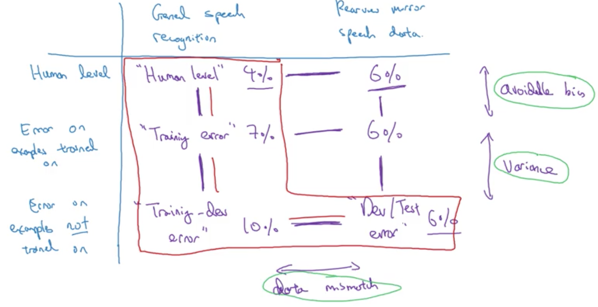

# ML Strategy - 2

## Learning Objectives 
* Understand what multi-task learning and transfer learning are. 
* Recognize bias, variance and data-mismatch by looking at the performances of your algorithm on train/dev/test sets. 

### 1. Error Analysis 
* estimating the ceiling on different ideas

 
* cleaning up incorrectly labeled data

_if it's systematic errors, then it will be an issue for the DL algorithm. e.g. consistently incorrectly label lions as cats._
* if the incorrectly labeled data are in dev set, add another colomn in the error analysis  

* advice on correcting incorrect samples

* build your first system quickly, then iterate

### 2. Mismatched training and dev/test set
* Training and Testing on Different Distributions

* Bias and Variance with mismatched data distributions
	* _issues: training data & dev + test data come from different distributions._
	* if the distributions of training data & dev data are different, it's no longer valid to draw conclusions about bias and variance. 
	
	
	
* addressing data mismatch - general guideline

* artificial data synthesis
 

### 3. Trabsfer Learning 
* initialize the weights for the last layer & re-train (_either re-train the last layer if you have a small dataset or the entire NN if you have a large dataset_) the NN on the new dataset. 
  
__Pre-training -> Fine Tuning__  

* Transfer Learning is commonly used from pre-training a large dataset and then move onto a smaller fina tuning dataset. It would not make sense / be meaningful if it's other way around. 
* When makes sense: 

### 4. Multi-task Learning 
* Simple auto-driving vehicle 
  
* __Good__:Performance is better than training each of the individual NNs. Even if some examples only have partial labels, it still can be trained (only consider label attributes in the loss function).  
  
_one example can have multiple labels - [0 1 1 0 1].T_
* When makes sense: 

* Much less often used. Mostly used in computer vision - object detection. 

### 5. End-to-End Deep Learning
* replace multi-stage systems by a single NN.
* end-to-end approach requires a large amount of data to work well. 
  
  
* end to end approach might not work well in the following example:  

* pros & cons:  

* Applying end-to-end approach

_the second example won't work well with end-to-end deep learning due to its complexity._

## Weekly Bio: Ruslan Salakhutdinov
* Director of Research in Apple
* [Restricted Boltzmann machine](https://en.wikipedia.org/wiki/Restricted_Boltzmann_machine)
* Unsupervised vs. Supervised: unsupervised pre-training models can help supervised learning. 
* Generative models: we haven't quite figure it out.
* How to utilise GPU? 
* Advice on entering DL: 
	* try different & new things; don't be afraid. 
	* code the low-level implementations
* Ph.D vs. Industry:	
	* in academia: you have more freedom;
	* in industry: affect more people; more resources; 
* Exciting frontier: __Deep Reinforcement learning, Reasoning NL understanding, Transfer Learning (on new tasks with small datatset).__
