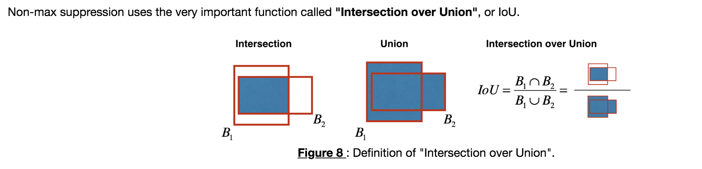

## Autonomous driving application - Car detection

### Objectives
* Use object detection on a car detection dataset.  
* Deal with bounding boxes.  

### Notes 
* Another definition of the prediction label. 
  
* If you have 80 classes that you want YOLO to recognize, you can represent the class label  cc  either as an integer from 1 to 80, or as an 80-dimensional vector (with 80 numbers) one component of which is 1 and the rest of which are 0.  
* __IoU__:
  
* YOLO is a state-of-the-art object detection model that is fast and accurate. 
* It runs an input image through a CNN which outputs a 19x19x5x85 dimensional volume.
* The encoding can be seen as a grid where each of the 19x19 cells contains information about 5 boxes.
* You filter through all the boxes using non-max suppression. Specifically:
	* Score thresholding on the probability of detecting a class to keep only accurate (high probability) boxes. 
	* Intersection over Union (IoU) thresholding to eliminate overlapping boxes. 
* Because training a YOLO model from randomly initialized weights is non-trivial and requires a large dataset as well as lot of computation, we used previously trained model parameters in this exercise. If you wish, you can also try fine-tuning the YOLO model with your own dataset, though this would be a fairly non-trivial exercise.

### Common Practice
* The process of filtering bounding boxes of YOLO: 	
	* Score-thresholding: throw away boxes that have detected a class with a score less than the threshold. 
	* Non-max suppression: Compute the Intersection over Union and avoid selecting overlapping boxes. 