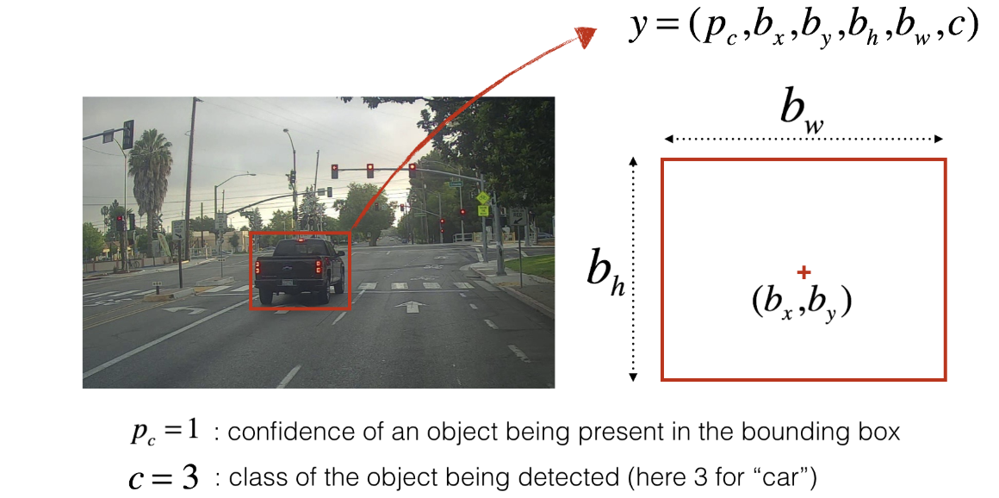

## Autonomous driving application - Car detection

### Objectives
* Use object detection on a car detection dataset.  
* Deal with bounding boxes.  

### Notes 
* Another definition of the prediction label. 
  
* If you have 80 classes that you want YOLO to recognize, you can represent the class label  cc  either as an integer from 1 to 80, or as an 80-dimensional vector (with 80 numbers) one component of which is 1 and the rest of which are 0.  
* 
### Common Practice

