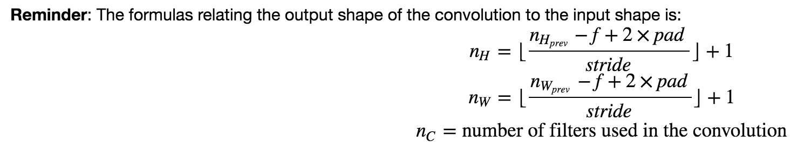
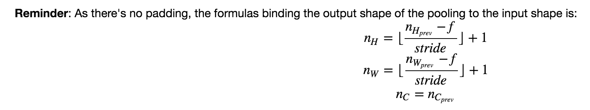

## Convolutional Model: step by step

### Objectives
* In this assignment, you will implement convolutional (CONV) and pooling (POOL) layers in numpy, including both forward propagation and (optionally) backward propagation.

### Notes
* The main benefits of padding are the following:
	1. It allows you to use a CONV layer without necessarily shrinking the height and width of the volumes. This is important for building deeper networks, since otherwise the height/width would shrink as you go to deeper layers. An important special case is the "same" convolution, in which the height/width is exactly preserved after one layer.
	2. It helps us keep more of the information at the border of an image. Without padding, very few values at the next layer would be affected by pixels as the edges of an image.  
* The pooling (POOL) layer reduces the height and width of the input. It helps reduce computation, as well as helps make feature detectors more invariant to its position in the input.
* These pooling layers have no parameters for backpropagation to train. However, they have hyperparameters such as the window size  ff . This specifies the height and width of the fxf window you would compute a max or average over.

### Common Practice 
* Dimensions of convolution layer: 
 
* Dimensions of pooling layer: 

