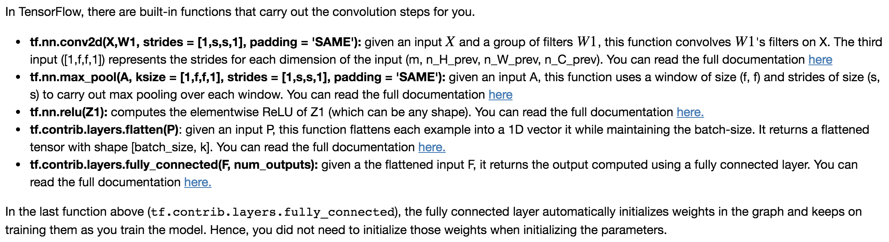
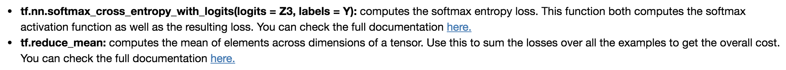

## Convolutional Neural Networks: Application

### Objectives
* Implement helper functions that you will use when implementing a TensorFlow model. 
* Implement a fully functioning ConvNet using TensorFlow. 

### Notes
* You will initialize weights/filters `W1`  and  `W2` using `tf.contrib.layers.xavier_initializer(seed = 0)`. You don't need to worry about bias variables as you will soon see that TensorFlow functions take care of the bias.

### Common Practice 
* TensorFlow built-in functions for CNN:
 

