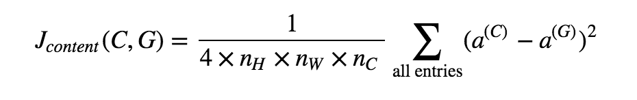
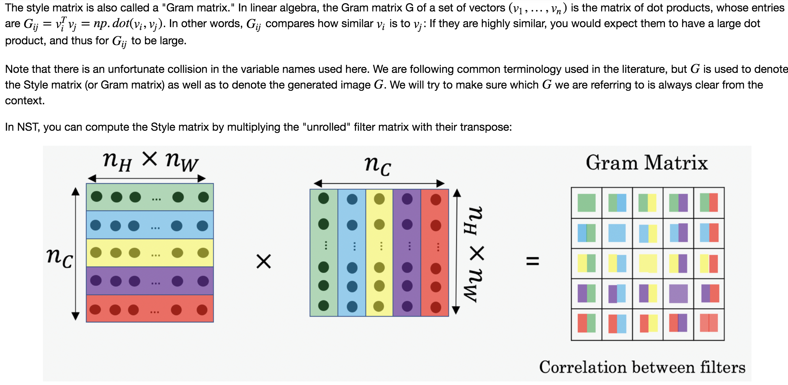
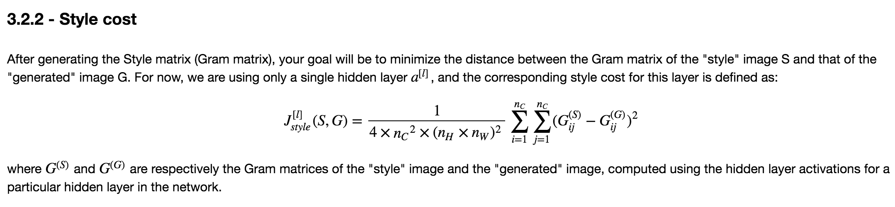
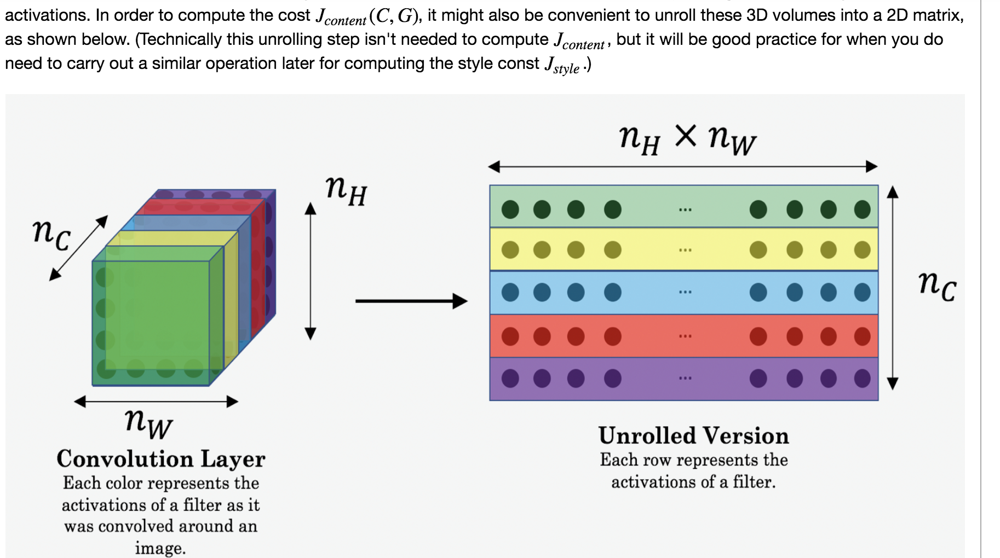

## Deep Learning & Art: Neural Style Transfer 

### Objectives 
* Implement the neural style transfer algorithm. 
* Generate novel artistic images using your algorithm. 

### Notes 
* In practice, you'll get the most visually pleasing results if you choose a layer in the middle of the network--neither too shallow nor too deep.
* Content Cost:  
  
* Style Cost: 
 
   
* One important part of the gram matrix is that the diagonal elements such as  GiiGii  also measures how active filter  i  is. For example, suppose filter  i  is detecting vertical textures in the image. Then  Gii  measures how common vertical textures are in the image as a whole: If  Gii  is large, this means that the image has a lot of vertical texture.  
* Neural Style Transfer is an algorithm that given a content image C and a style image S can generate an artistic image.  
* It uses representations (hidden layer activations) based on a pretrained ConvNet.
* The content cost function is computed using one hidden layer's activations.
* The style cost function for one layer is computed using the Gram matrix of that layer's activations. The overall style cost function is obtained using several hidden layers.
* Optimizing the total cost function results in synthesizing new images.

### Common Practice
* Unrolling Volumes
  
* The style of an image can be represented using the Gram matrix of a hidden layer's activations. However, we get even better results combining this representation from multiple different layers. This is in contrast to the content representation, where usually using just a single hidden layer is sufficient.  
* Unlike a regular session, the "Interactive Session" installs itself as the default session to build a graph. This allows you to run variables without constantly needing to refer to the session object, which simplifies the code.
* [InteractiveSession](https://www.tensorflow.org/api_docs/python/tf/InteractiveSession)  

### References

The Neural Style Transfer algorithm was due to Gatys et al. (2015). Harish Narayanan and Github user "log0" also have highly readable write-ups from which we drew inspiration. The pre-trained network used in this implementation is a VGG network, which is due to Simonyan and Zisserman (2015). Pre-trained weights were from the work of the MathConvNet team. 

* [Leon A. Gatys, Alexander S. Ecker, Matthias Bethge, (2015). A Neural Algorithm of Artistic Style](https://arxiv.org/abs/1508.06576) 
* [Harish Narayanan, Convolutional neural networks for artistic style transfer.](https://harishnarayanan.org/writing/artistic-style-transfer/)  
* [Log0, TensorFlow Implementation of "A Neural Algorithm of Artistic Style".](http://www.chioka.in/tensorflow-implementation-neural-algorithm-of-artistic-style)  
* [Karen Simonyan and Andrew Zisserman (2015). Very deep convolutional networks for large-scale image recognition](https://arxiv.org/pdf/1409.1556.pdf)
* [MatConvNet.](http://www.vlfeat.org/matconvnet/pretrained/)

