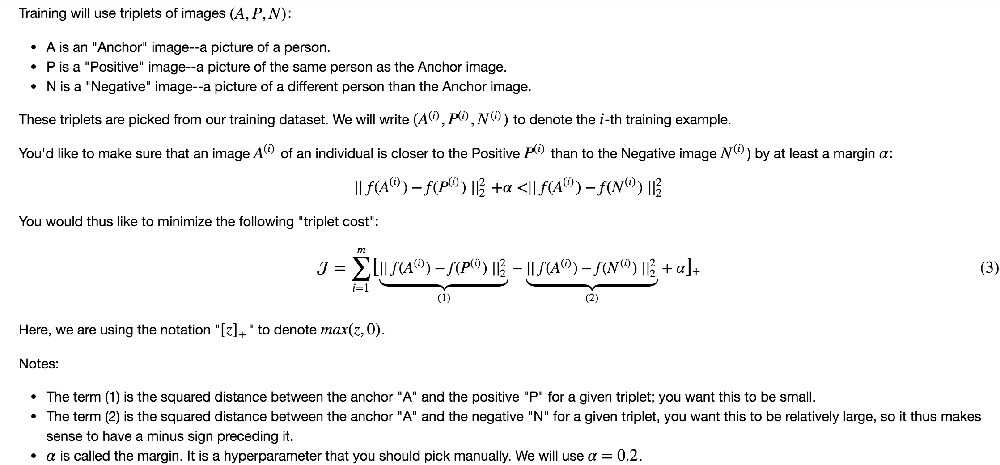

## Face Recognition for the Happy House 

### Objectives 
* Implement the triplet loss function. 
* Use a pretrained model to map face images into 128-dimensional encodings. 
* Use these encodings to perform face verification and face recognition. 

### Notes 
* training triplet function 
  
* Face verification solves an easier 1:1 matching problem; face recognition addresses a harder 1:K matching problem.
* The triplet loss is an effective loss function for training a neural network to learn an encoding of a face image.
* The same encoding can be used for verification and recognition. Measuring distances between two images' encodings allows you to determine whether they are pictures of the same person. 
* distance between 2 encodings: `np.linalg.norm(encoding1-encoding2)`  
 
### Common Pratice 
* So, an encoding for a face image is a good one if:
	* The encodings of two images of the same person are quite similar to each other. 
	* The encodings of two images of different persons are very different. 
* Here're some ways to further improve the algorithm:
	* Put more images of each person (under different lighting conditions, taken on different days, etc.) into the database. Then given a new image, compare the new face to multiple pictures of the person. This would increae accuracy.
	* Crop the images to just contain the face, and less of the "border" region around the face. This preprocessing removes some of the irrelevant pixels around the face, and also makes the algorithm more robust. 

### References

* Florian Schroff, Dmitry Kalenichenko, James Philbin (2015). [FaceNet: A Unified Embedding for Face Recognition and Clustering](https://arxiv.org/pdf/1503.03832.pdf)
* Yaniv Taigman, Ming Yang, Marc'Aurelio Ranzato, Lior Wolf (2014). [DeepFace: Closing the gap to human-level performance in face verification](https://research.fb.com/wp-content/uploads/2016/11/deepface-closing-the-gap-to-human-level-performance-in-face-verification.pdf) 
* [The pretrained model we use is inspired by Victor Sy Wang's implementation and was loaded using his code:] (https://github.com/iwantooxxoox/Keras-OpenFace.)
* [Our implementation also took a lot of inspiration from the official FaceNet github repository](https://github.com/davidsandberg/facenet) 
