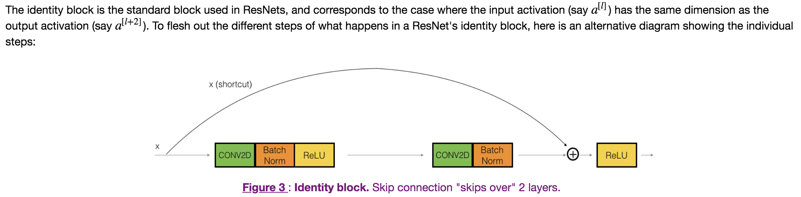
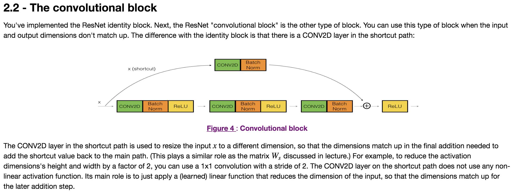

## Residual Networks

### Objectives
* Implement the basic building blocks of ResNets.
* Put together these building blocks to implement and train a state-of-the-art neural network for image classification. 

### Notes
* very deep networks often have a gradient signal that goes to zero quickly, thus making gradient descent unbearably slow. More specifically, during gradient descent, as you backprop from the final layer back to the first layer, you are multiplying by the weight matrix on each step, and thus the gradient can decrease exponentially quickly to zero (or, in rare cases, grow exponentially quickly and "explode" to take very large values).
* In ResNets, a "shortcut" or a "skip connection" allows the gradient to be directly backpropagated to earlier layers. 

### Commmon Practice 
* There are generally 2 types of blocks in Residual Network: 
	* The identity block
	  
	* The Convolotional block
	  
	