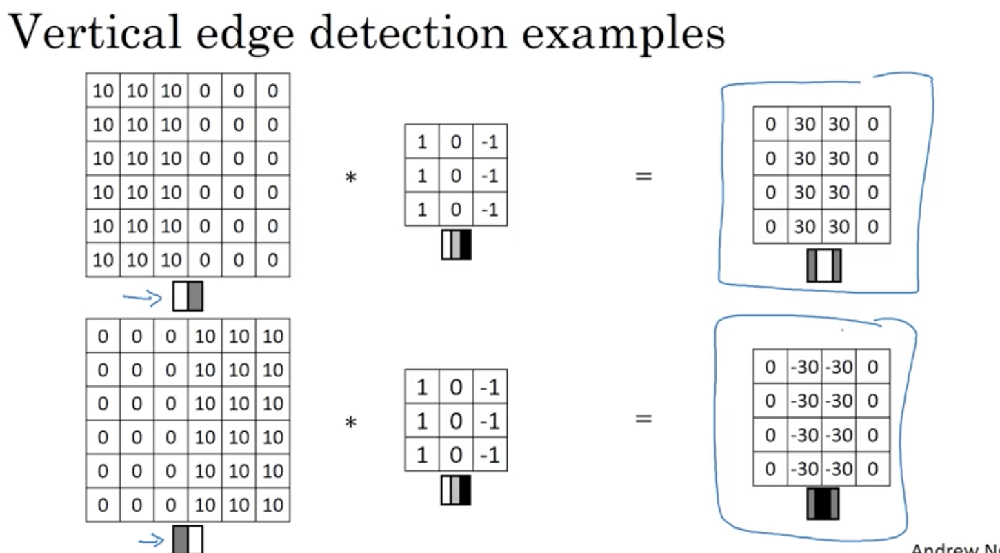

# Foundations of Convolutional Neural Networks

## Learning Objectives 
* Understand the convolution operation. 
* Understand the pooling operation. 
* Remember the vocabulary used in convolutional neural network (padding, stride, filter, ...). 
* Build a convolutional neural network for image multi-class classification. 

### 1. Computer Vision 
* computer vision problems 
 
* DL challenges on CV

### 2. Edge Detection Example  
  

* computational details (convolution operation `*`) for vertical edge detaction.    
   
 

  
* different filters  
  
  

### 3. Padding 
* issues with previous computation: 
	* pixels at the corners & edges are less frequently used than the ones in the middle. 
	* images shrink as more filters applied. 
* so we introduce the concept of padding around the original image.  
 
* valid & same convolutions 
 

### 4. Strided Convolutions
* stride == number of steps when the filter moves horizontally and vertically.  
 
* by convention, if the filter is outside the image+padding, then do not perform any convolution operation on that. 

* note: the convolution operation is actually croass-correlation technically but we just simply call it convolution in ML literature. 

### 5. Convolution Over Volumes 
* the number of channels must match.  
 
  
* multiple filters 

### 6. Convolutional Network 
* an example of a layer
 
* summary of notation
 
* a deeper ConvNet
 
* different types of layer in convolutional network:
	* convolution
	* pooling
	* fully connected 

