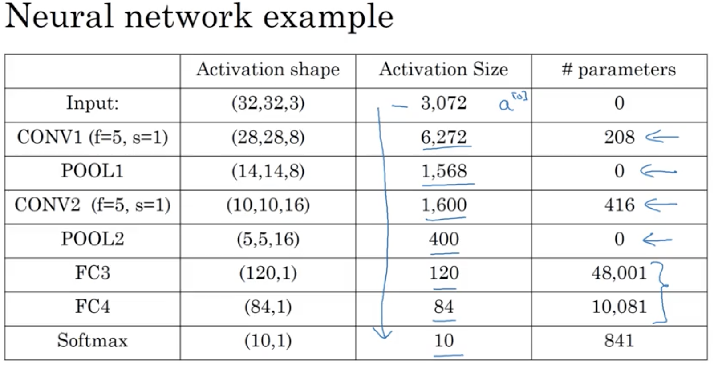

# Foundations of Convolutional Neural Networks

## Learning Objectives 
* Understand the convolution operation. 
* Understand the pooling operation. 
* Remember the vocabulary used in convolutional neural network (padding, stride, filter, ...). 
* Build a convolutional neural network for image multi-class classification. 

### 1. Computer Vision 
* computer vision problems 
 
* DL challenges on CV

### 2. Edge Detection Example  
  

* computational details (convolution operation `*`) for vertical edge detaction.    
   
 

  
* different filters  
  
  

### 3. Padding 
* issues with previous computation: 
	* pixels at the corners & edges are less frequently used than the ones in the middle. 
	* images shrink as more filters applied. 
* so we introduce the concept of padding around the original image.  
 
* valid & same convolutions 
 

### 4. Strided Convolutions
* stride == number of steps when the filter moves horizontally and vertically.  
 
* by convention, if the filter is outside the image+padding, then do not perform any convolution operation on that. 

* note: the convolution operation is actually croass-correlation technically but we just simply call it convolution in ML literature. 

### 5. Convolution Over Volumes 
* the number of channels must match.  
 
  
* multiple filters 

### 6. Convolutional Network 
* an example of a layer
 
* summary of notation
 
* a deeper ConvNet
 
* different types of layer in convolutional network:
	* convolution
	* pooling
	* fully connected 

### 7. Pooling Layers
* max pooling (it's a fixed computation, no parameter to learn)
  
  
* average pooling 
  
* pooling applies to each of the channel individually. 
* max pooling is more common than average pooling in practice. 
* hyperparameters of pooling
  

### 8. A CNN Example 
* usually, we only  count the layers with parameters to learn to be the total number of layers in a CNN. 
* __Fully Connected Layer__: it's just similar to a regular layer you would see in neural network with weights & bias to learn. 
* example: similar to [LeNet-5](http://yann.lecun.com/exdb/lenet/)  
  
  
* __When calculating the number of parameters for a Conv layer with 1 filter, it should be fw[l] * fh[l] * nc[l-1] + 1. While, for multiple filters, it would then be (fw[l] * fh[l] * nc[l-1] + 1) * nc[l].__   
* _Notice that the number of parameters in this table are mostly are incorrect. The last 3 should be:_  
`FC3: 120 * 400 (W matrix) + 120 (bias) = 48,120`
`FC4: 84 * 120 (W matrix) + 84 (bias) = 10,164` 
`Softmax: 10 * 84 (W matrix) + 10 (bias) = 850`

### 9. Why to use convolution
* ConvNet generally have way fewer parameters to learn. 
* __advantages of ConvNet:__
	* parameter sharing  
	* sparsity of connections  
  
* It's common to use other researchers' well-tested architecture to the problem you have at hand. 

## Weekly Bio: Yann LeCun
* [OPTIMAL PERCEPTUAL INFERENCE](https://papers.cnl.salk.edu/PDFs/Optimal%20Perceptual%20Inference%201983-646.pdf)
* [Conditional random field](https://en.wikipedia.org/wiki/Conditional_random_field) 
* [DjVu](https://en.wikipedia.org/wiki/DjVu)
* Advice for entering AI: 
	* learn from the Internet 
	* make yourself valuable
	* contribute to the open source community 