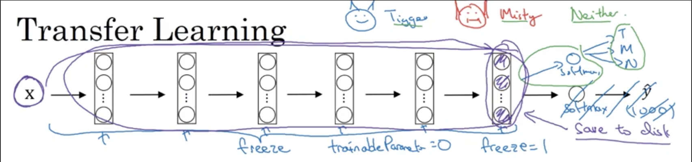
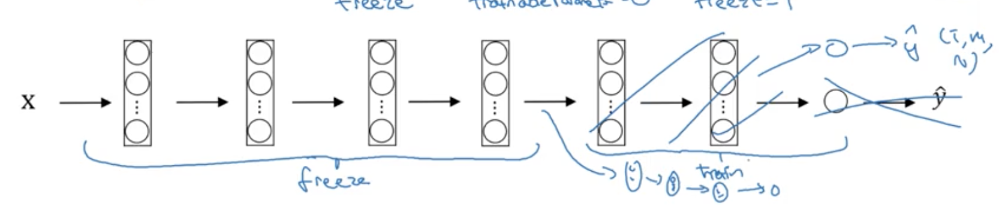
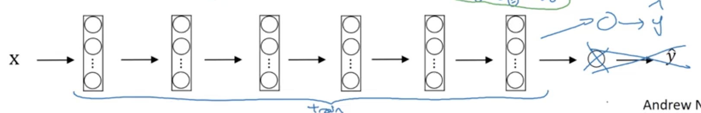
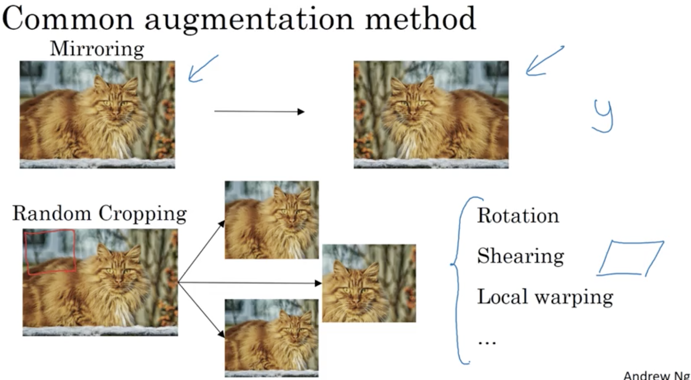
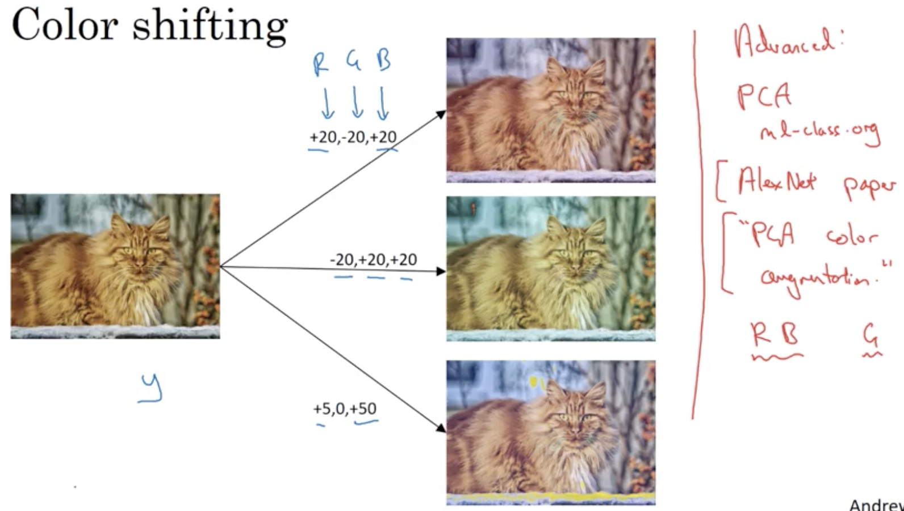
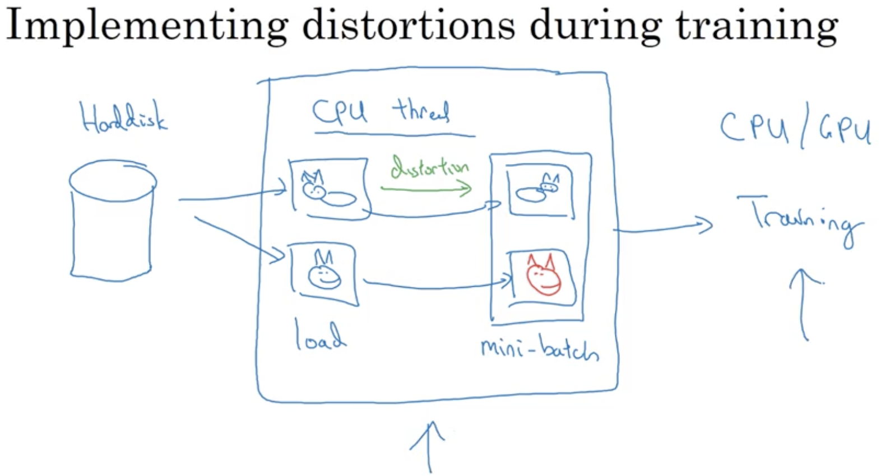
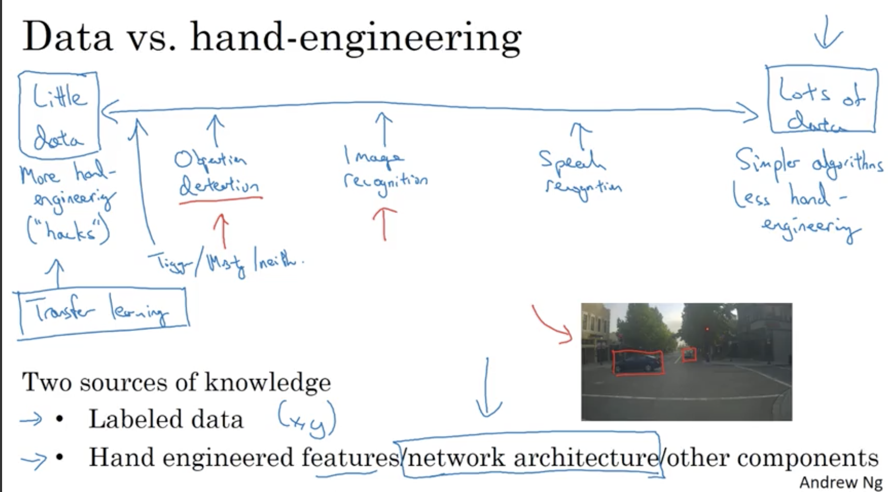
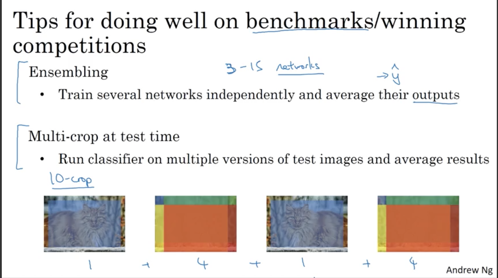
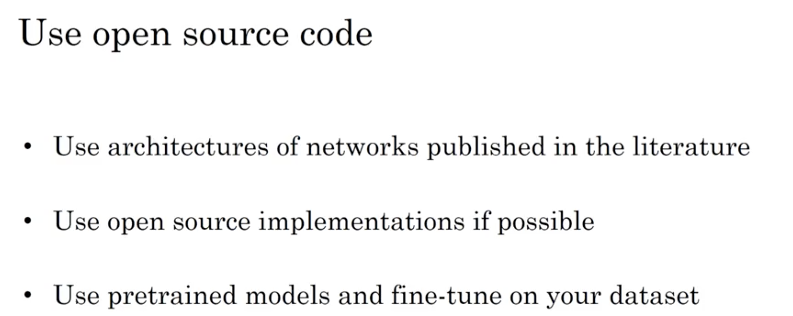

# Deep convolutional models: case studies

## Learning Objectives 
* Understand multiple foundational papers of convolutional neural networks. 
* Analyze the dimensionality reduction of a volume in a very deep network. 
* Understand and Implement a Residual network
Build a deep neural network using Keras. 
* Implement a skip-connection in your network. 
* Clone a repository from github and use transfer learning. 

### 1. Classic Networks  
#### a) LeNet-5: identify hand-written digits on greyscale images  
   

#### b) AlexNet: Large Scale Visual Recognition  
  

#### c) VGG - 16: Large Scale Visual Recognition  
  

### 2. Residual Network 
* __Residual Block:__  
  
  
* Why ResNet so well? 
	* ReLU = _/ to get back the original `a^[l]`.
	* identity function is easy for residual block to learn.   
	
	_Note that if the dimensions of Res Layer are not consistent, you could add another W matrix to adjust it._  
	   
	
### 3. Inception Neural Network 
* __1 x 1 convolution:__  
  
  
* __Inception Layer:__ perform all the operations you want altogether, though computational cost is high. 
  
* computational cost
  
* use a 1x1 convolution to reduce the computational cost 
  
_It won't hurt the performance of the neural network._
* __inception network__
  
  
_Notice that there are some side-branches. Those are used for making early predictions in hidden layers._ 

### 4. Practical Advice on ConvNets
* using open-source implementation: 
	* look for online open-source implementation of a particular research paper. 
	* mostly on Github.  
* you could also download pre-trained parameter values for transfer learning (usually as intialization values).
* For a small dataset: 
  
_Note: a) freeze: do not train early parameters and only train the last few layers. b) save to disk: compute the previous layers result Z-n and save it to disk for re-use of multiple epochs._  
* For a large dataset (train more layer at the end):  
  
* For an even larger dataset (use the parameters online as initialization): 
  
* Data Augmentation (most CV projects need a lot of data): 
	* Mirroring 
	* Random Cropping 
	* Rotation 
	* Shearing 
	* Local warping   
	 
	* color shifting  
	  
* run distortions in parallel with training. 
  

### 5. State of Computer Vision 
* hand-engineering   
  
* benchmarks & competitions  
   
* open-source code 
  

 
