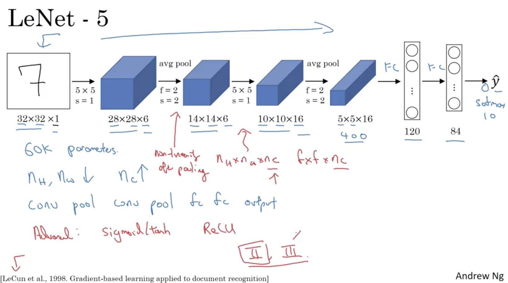
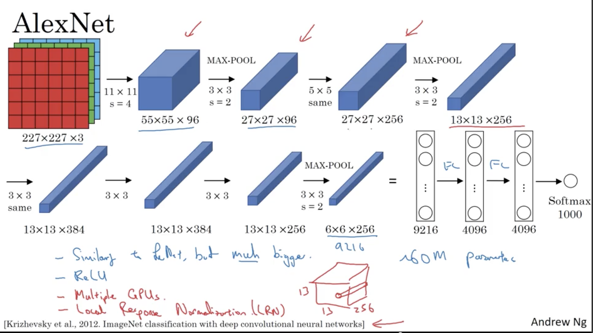
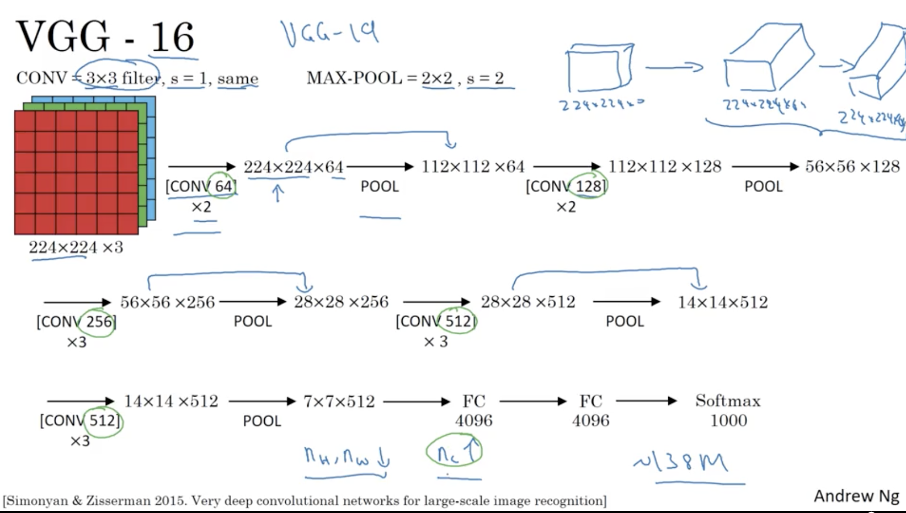
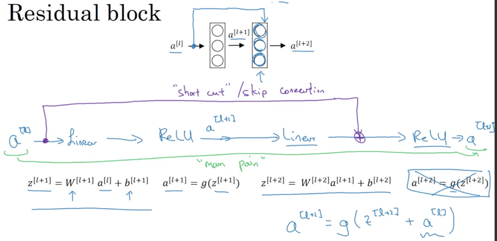
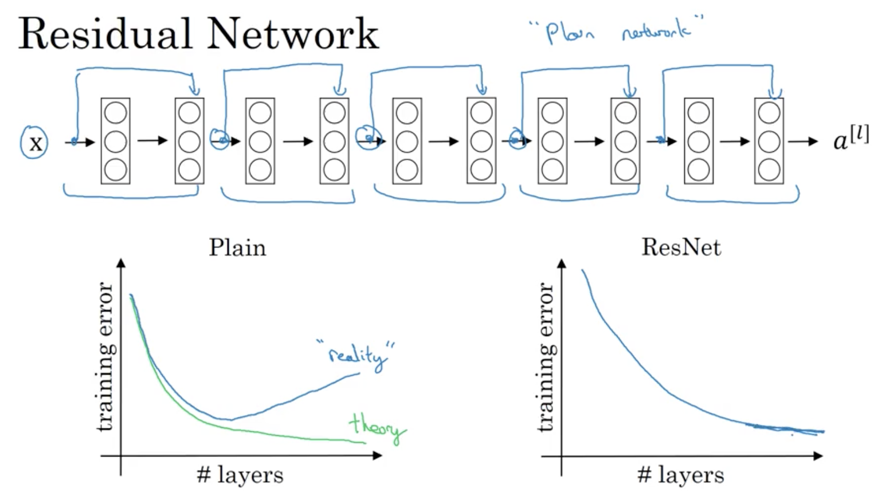
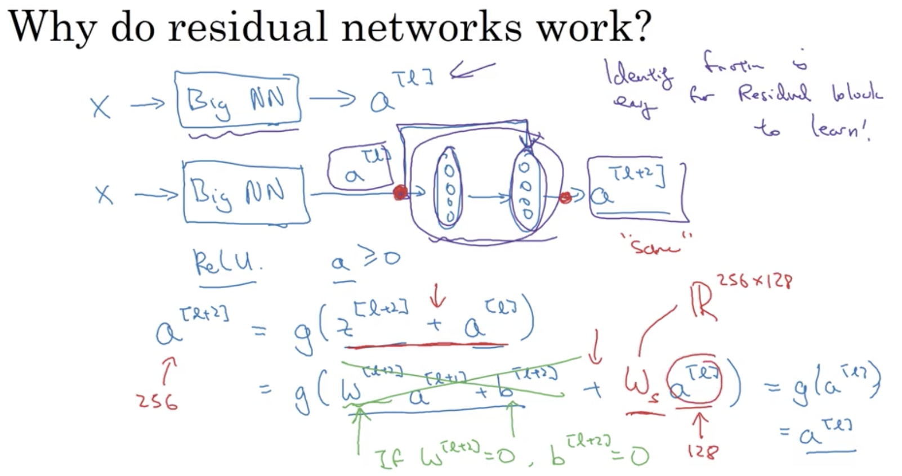
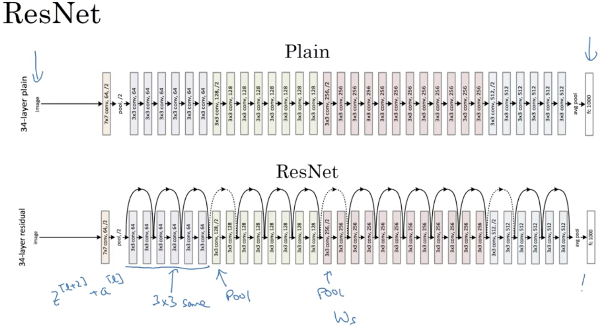

# Deep convolutional models: case studies

## Learning Objectives 
* Understand multiple foundational papers of convolutional neural networks. 
* Analyze the dimensionality reduction of a volume in a very deep network. 
* Understand and Implement a Residual network
Build a deep neural network using Keras. 
* Implement a skip-connection in your network. 
* Clone a repository from github and use transfer learning. 

### 1. Classic Networks  
#### a) LeNet-5: identify hand-written digits on greyscale images  
   

#### b) AlexNet: Large Scale Visual Recognition  
  

#### c) VGG - 16: Large Scale Visual Recognition  
  

### 2. Residual Network 
* __Residual Block:__  
  
  
* Why ResNet so well? 
	* ReLU = _/ to get back the original `a^[l]`.
	* identity function is easy for residual block to learn.   
	
	_Note that if the dimensions of Res Layer are not consistent, you could add another W matrix to adjust it._  
	   
	
### 3. Inception Neural Network 