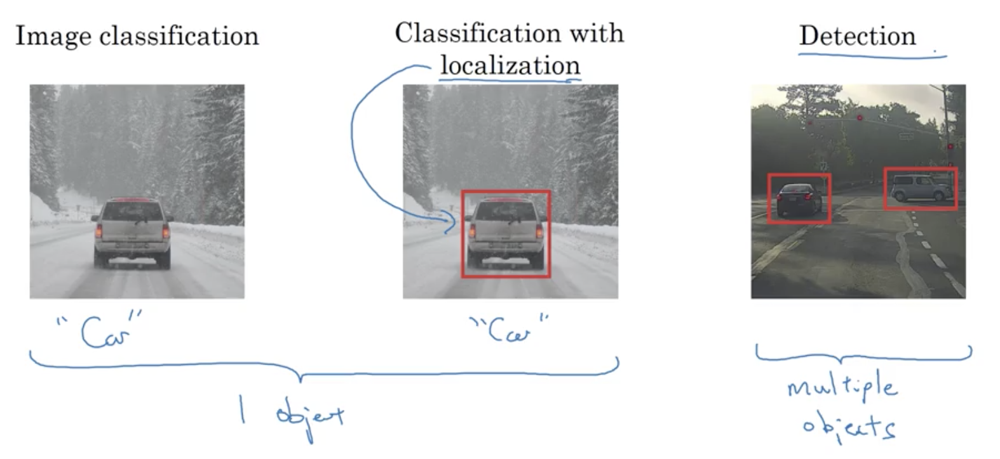
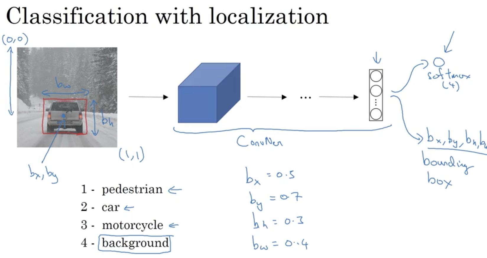
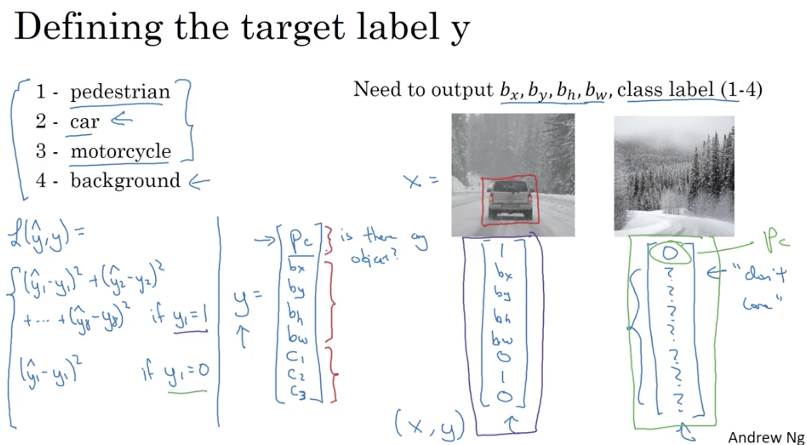
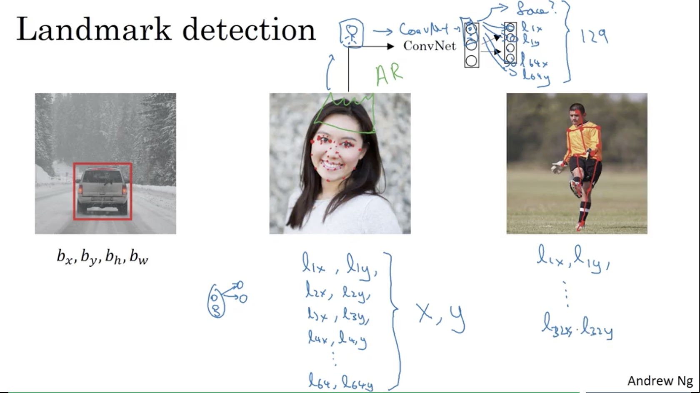

# Object Detection

## Learning Objectives
* Learn how to apply your knowledge of CNNs to one of the toughest but hottest field of computer vision: Object detection. 

### 1. Object Localization 
* what is object localisation? 
  
  
* Y contains the following parameters:
	* P_c: is there an object? 
	* b_x: x position of the center of the bounding box 
	* b_y: y position of the center of the bounding box 
	* b_h: the height of the bounding box 
	* b_w: the width of the bounding box 
	* c1 -> cn: the label of the object 
  
_Note that the loss function is defined on the left._

### 2. Landmark Detection
* __Landmarks:__ important points in the image.  
  
_Note: specifying key points in the image and make them the Y label. Though landmarks have to be consistent across multiple images._

### 3. 

