# Object Detection

## Learning Objectives
* Learn how to apply your knowledge of CNNs to one of the toughest but hottest field of computer vision: Object detection. 

### 1. Object Localization 
* what is object localisation? 
  
  
* Y contains the following parameters:
	* P_c: is there an object? 
	* b_x: x position of the center of the bounding box 
	* b_y: y position of the center of the bounding box 
	* b_h: the height of the bounding box 
	* b_w: the width of the bounding box 
	* c1 -> cn: the label of the object 
  
_Note that the loss function is defined on the left._

### 2. Landmark Detection
* __Landmarks:__ important points in the image.  
  
_Note: specifying key points in the image and make them the Y label. Though landmarks have to be consistent across multiple images._

### 3. Object Detection 
* train a ConvNet for closely cropped images. 
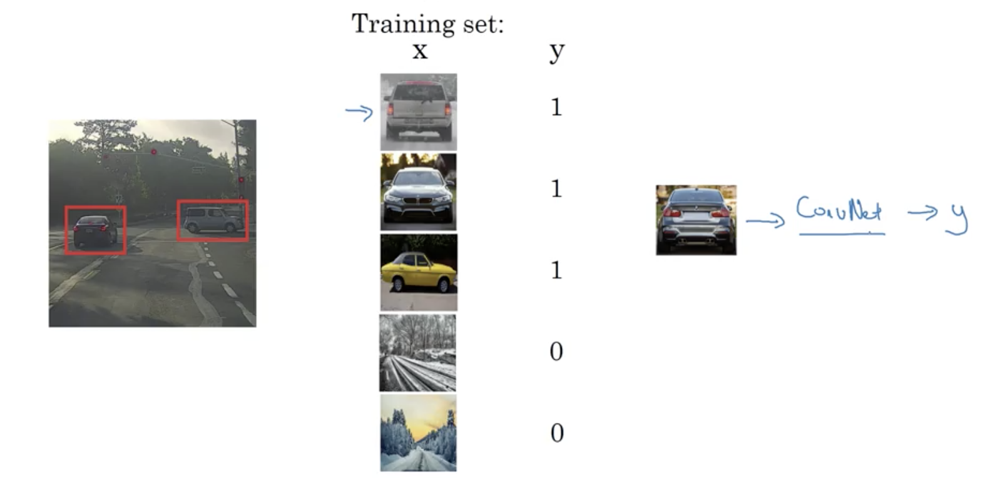 
* sliding windows detection  
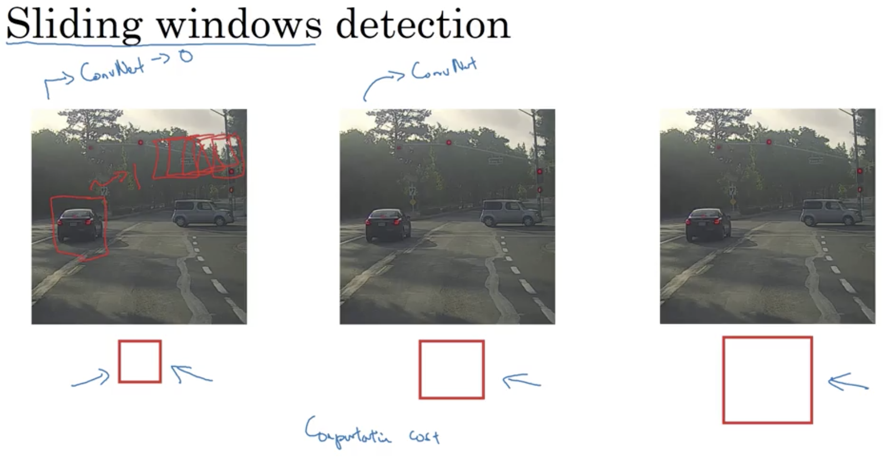  
_the computational cost is high due to the number of windows when stride is small & different sizes._
* turning FC layer into convolutional layers
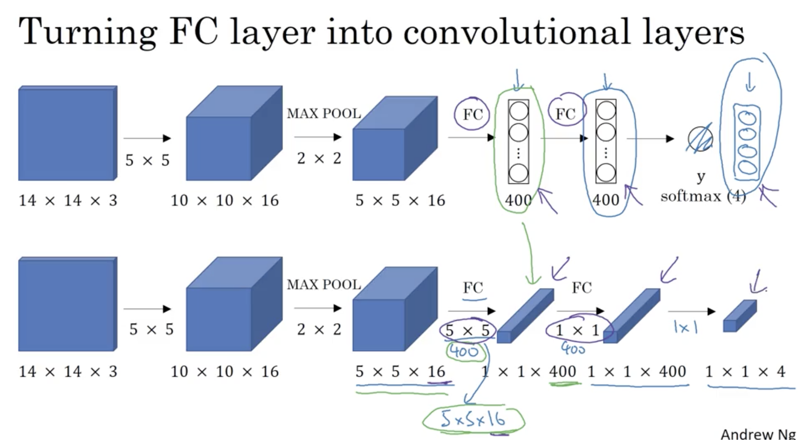  
* convolutional implementation of sliding windows  
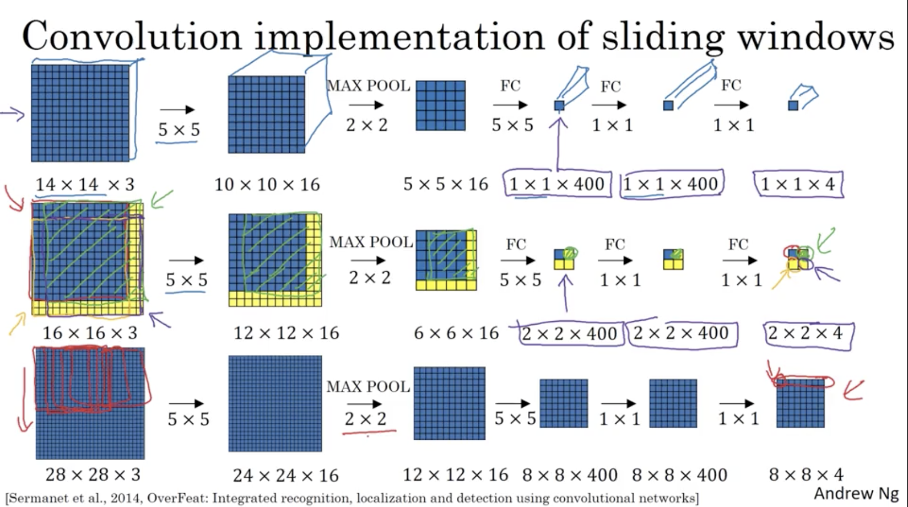  
_It is because of the 2x2 max pooling layer so that it is equivelant to have a stride of 2 for the sliding windows._  
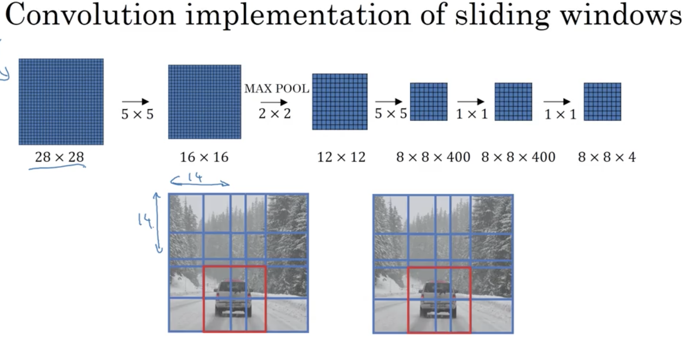  

### 4. bounding box predictions  
* use a basic YOLO algorithm
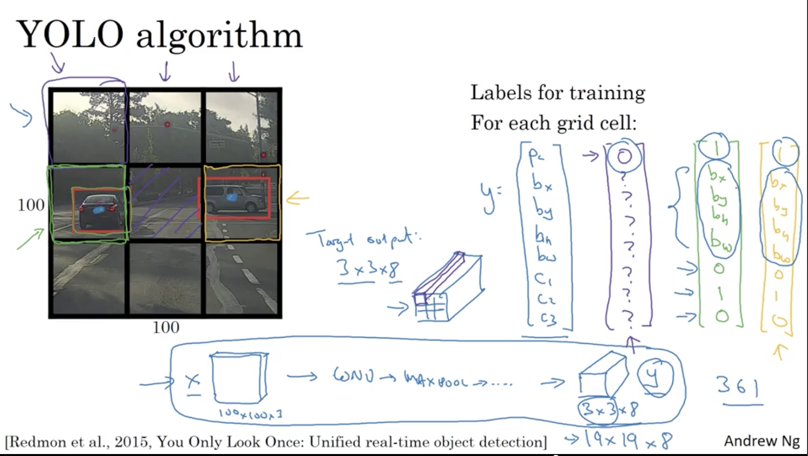 
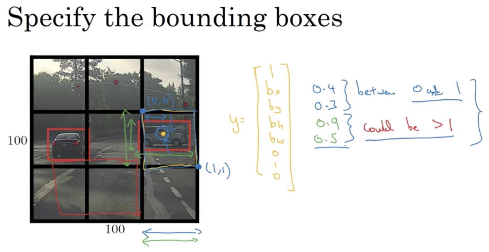
* intersection over union  
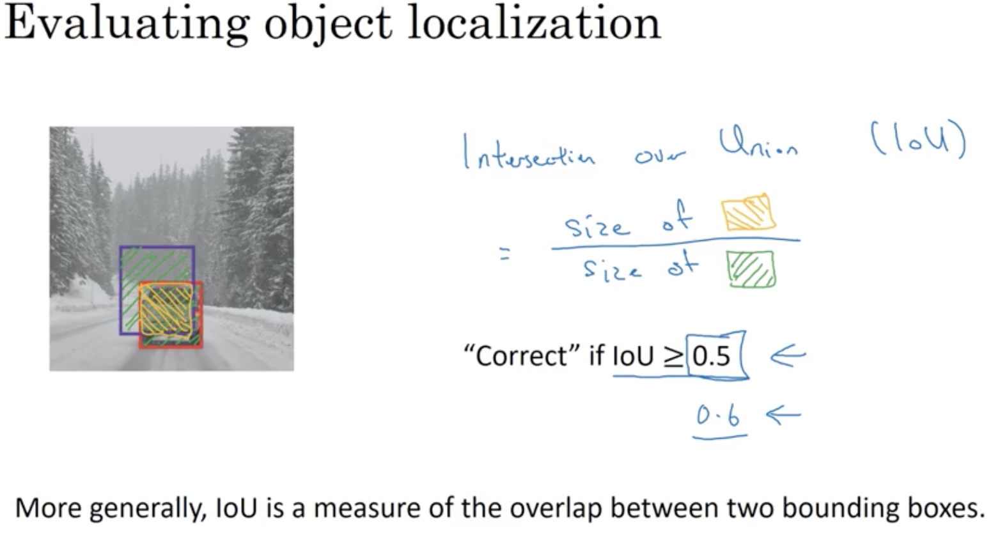  
__intersection / union__
* non-max suppresion
	* it makes sure 1 object is only detected once. 
	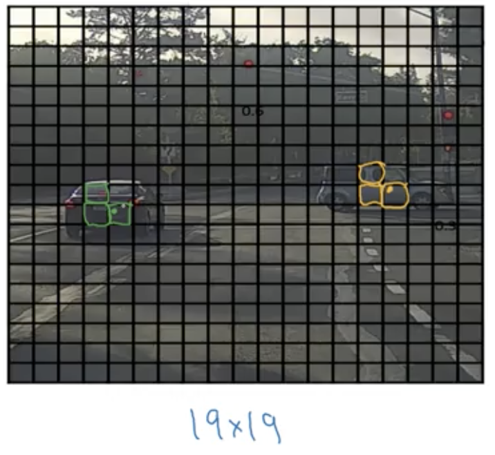  
	* method for suppression
		1. find the highest probability rectangular detection. 
		2. find other detections with high IoU and ignore them. 
		3. repeat 1 & 2. 
		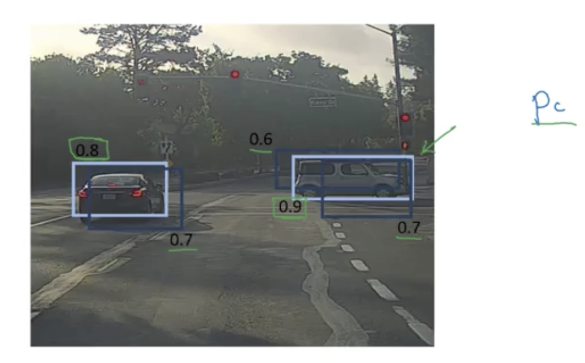  
		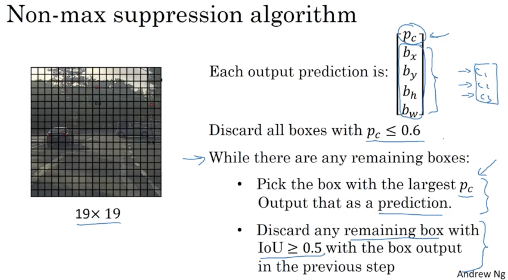  
* anchor boxes
	* issue: each grid cell can only detect 1 object
	* anchor boxes allow us to produce multiple prediction boxes in one grid cell. 
	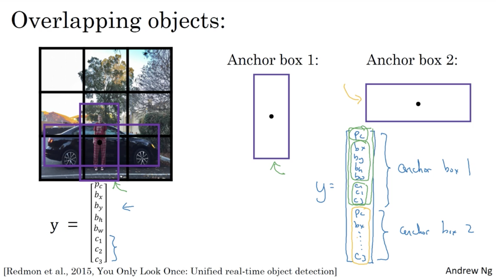 
	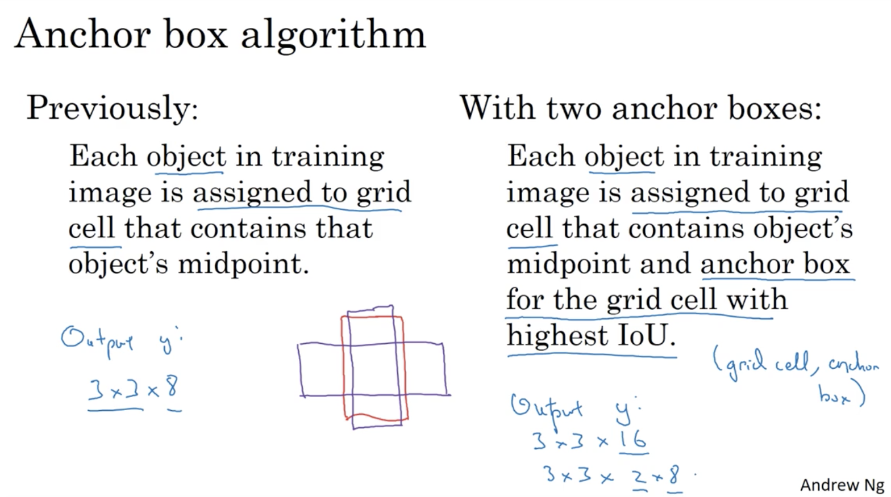 
	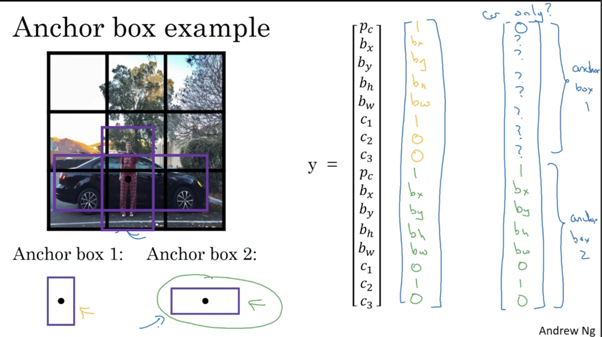   
	* though this particular examples doesn't do well on a) 3 objects in a cell & b) multiple objects are in the shape of only 1 anchor box. 
* how to choose anchor boxes
	* hand-pick 
	* use K-means algorithms to groups objects shapes you tend to get

### 5. YOLO Algorithm (all-in-one)
* Training 
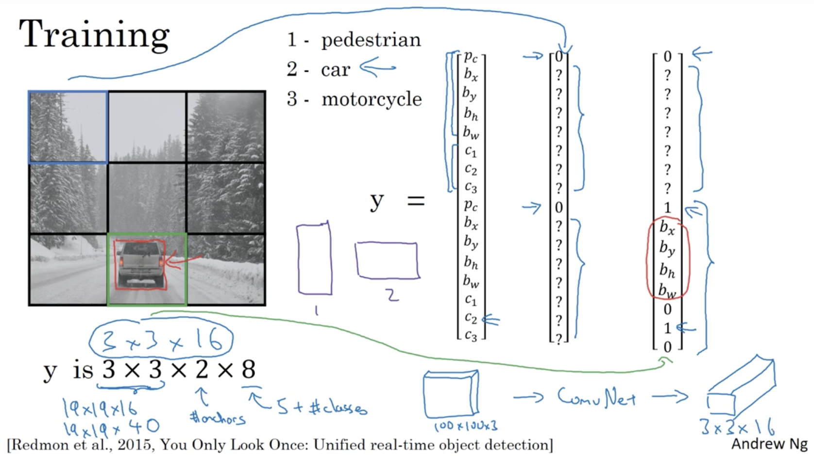  
* Prediction
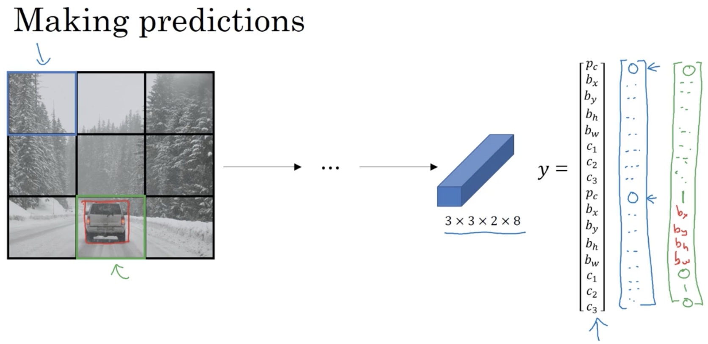
* Non-max Supression
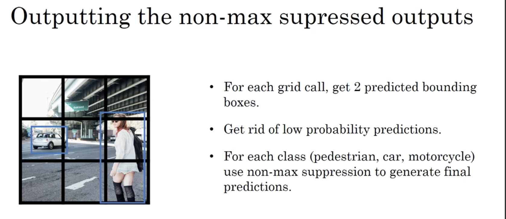  

### 6. Region Proposals
* pick a few regions (meaningful) that would make sense to run CNN on. 
* run the segmentation algorithms to produce blobs. 
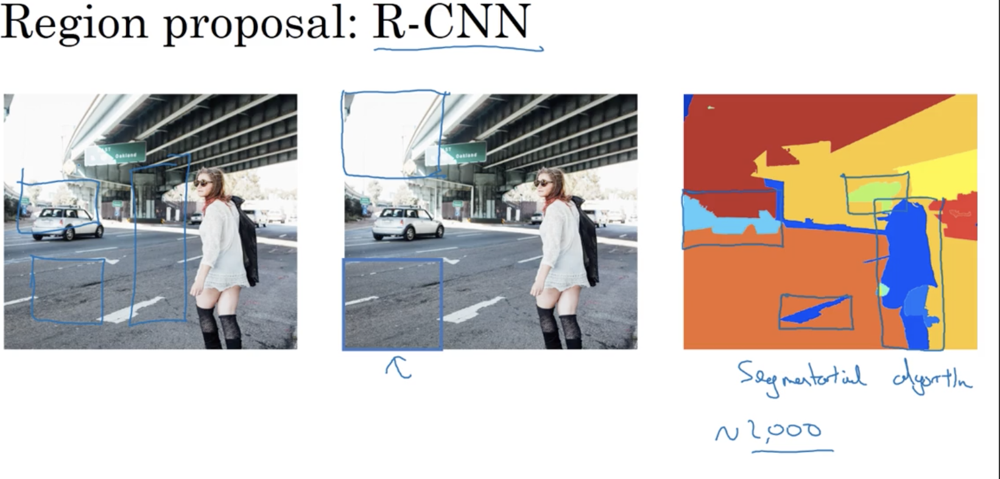  
* evolving ideas:
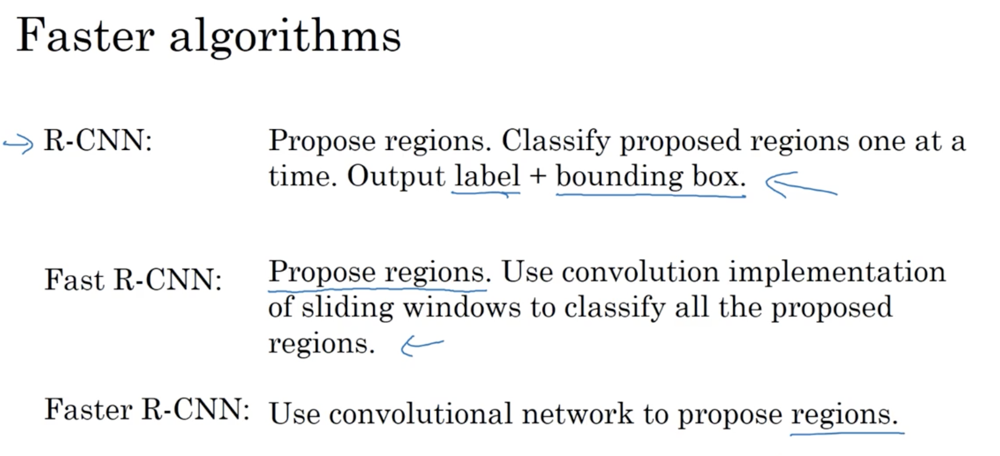 

		

