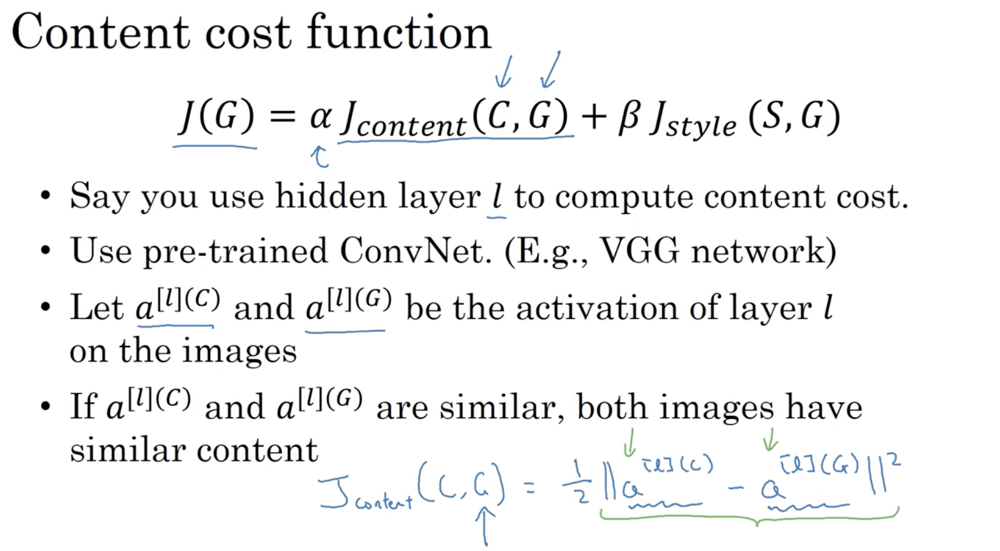
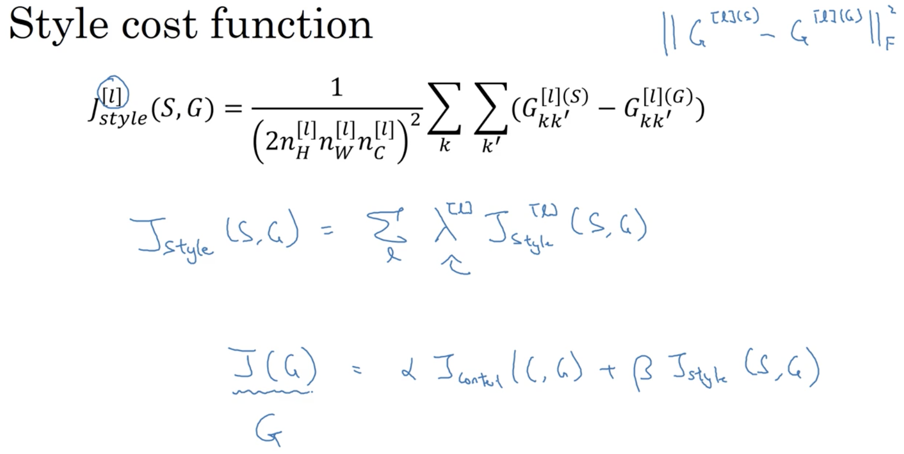

# Special applications: Face recognition & Neural style transfer 

## Learning Objectives 
* Discover how CNNs can be applied to multiple fields, including art generation and face recognition. Implement your own algorithm to generate art and recognize faces!

### 1. Face Recognition 
* face verification vs. face recognition
  
* __One-shot Learning__: predicting from 1 person's image/face. 
 
* challenges: 
	* a) training set is extremely small
	* b) not very extendable
* __similarity function__  
 

### 2. Siamese Network 
* feed both pictures to the same neural network and produce the final "feature vector" (i.e. the encoding of the input image)  
  
* training:  
 
* triplet loss function: 
	* you will need 3 images: anchor, positive, negative  
	 
	* definition of triplet loss: 
	  
* choosing the triplets 
  

### 3. Face Verification and Binary Classification
* uses siamese netwrok on 2 images (i.e. pairs) and add a logitsic unit at the end to predict 0/1. 
  
  
* pre-compute the encodings of images in the database for prediction 

### 4. What are deep ConvNets learning? 
* as the neural network goes deeper, neurons tend to learn more complex patterns. 
  
  

### 5. Neural Style Transfer 
* examples:  
 
[A neural Algorithm of Artistic Style](./A neural_Algorithm_of_Artistic_Style.pdf)  
* __cost function__  
 
	* content cost function  
	  
	_note that `l` is chosen to be neither too small nor too big._
	* style cost function  
	 
	
	_patterns across different channels_
	  
	_go from 1 layer to multiple layers_
	  
	_gram matrix_
* __learning__  
  

### 6. 1D & 3D Generalizations
* 1D generalization
  
* 3D generalization  
  

