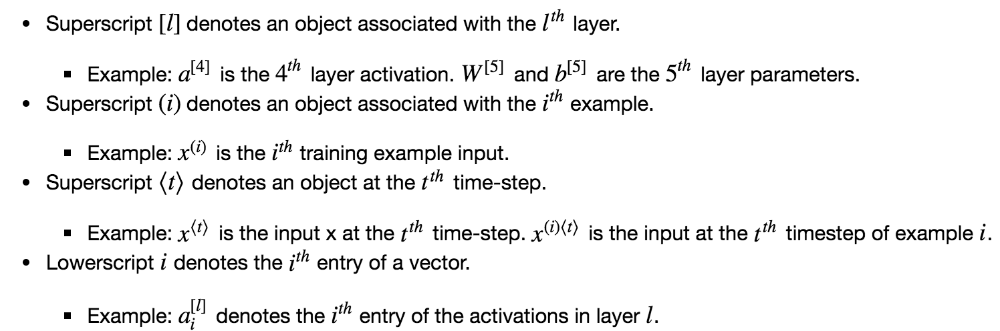
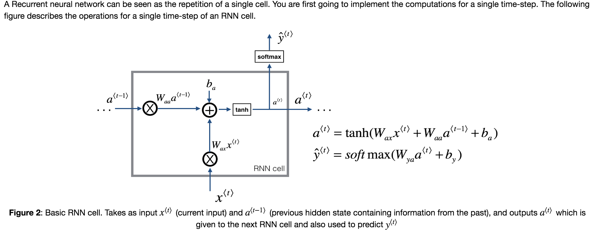

## Building a Recurrent Neural Network - Step by Step 

### Objectives 
* you will implement your first Recurrent Neural Network in numpy. 

### Notes 
* RNN notation 
  
* computation in single RNN cell  
  
* computation in single LSTM cell 
  

### Common Practice 

