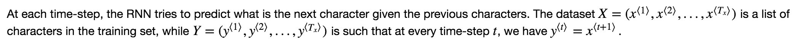
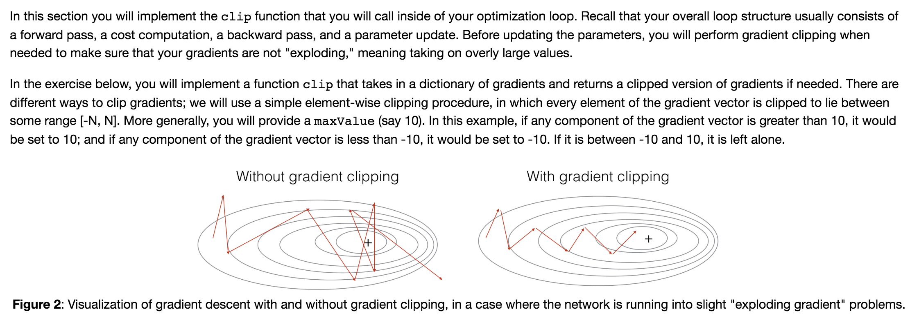
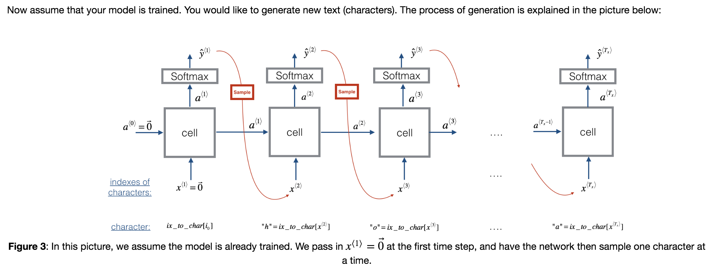
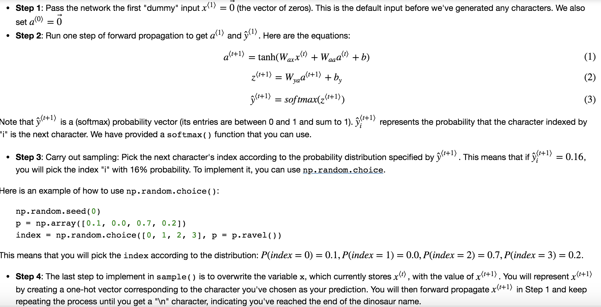

## Dinosaurus Island -- Character level language model

### Objectives
* How to store text data for processing using an RNN.  
* How to synthesize data, by sampling predictions at each time step and passing it to the next RNN-cell unit.  
* How to build a character-level text generation recurrent neural network.  
* Why clipping the gradients is important. 

### Notes
* Gradient Descent w.r.t. RNN
	* Forward propagate through the RNN to compute the loss
	* Backward propagate through time to compute the gradients of the loss with respect to the parameters
	* Clip the gradients if necessary
	* Update your parameters using gradient descent

### Common Practice 
* sequence generation trick 
  
* gradient clipping:  
  
* sampling:  
  
  
