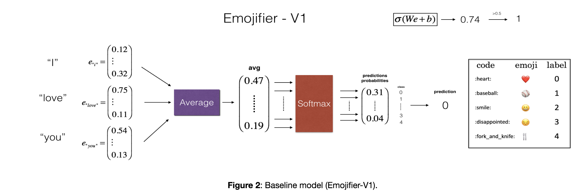
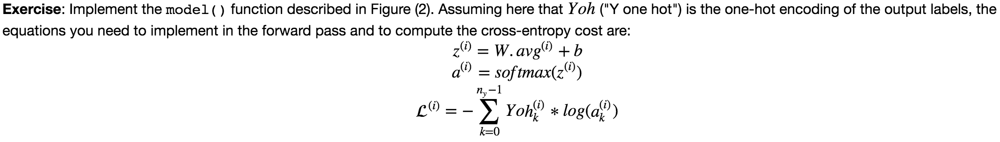
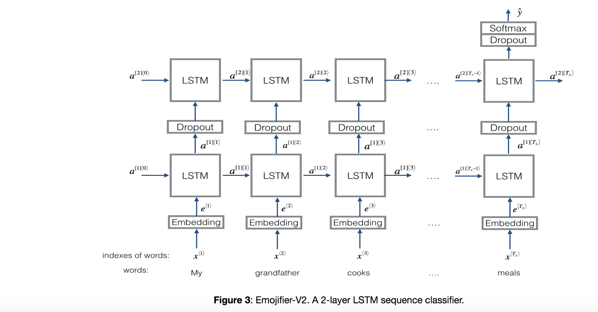
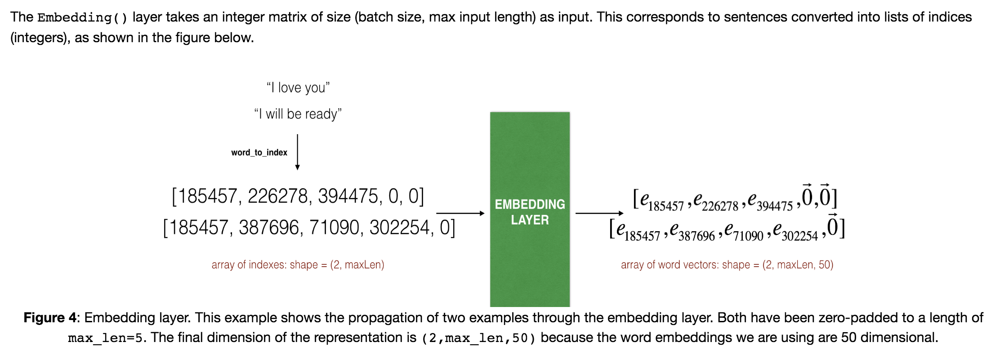

## Emojify 

### Objectives 
* You will implement a model which inputs a sentence (such as "Let's go see the baseball game tonight!") and finds the most appropriate emoji to be used with this sentence (⚾️). 
* you'll start with a baseline model (Emojifier-V1) using word embeddings, then build a more sophisticated model (Emojifier-V2) that further incorporates an LSTM. 

### Notes 
* Printing the confusion matrix can also help understand which classes are more difficult for your model. A confusion matrix shows how often an example whose label is one class ("actual" class) is mislabeled by the algorithm with a different class ("predicted" class).
* Even with a 127 training examples, you can get a reasonably good model for Emojifying. This is due to the generalization power word vectors gives you.
* Emojify-V1 will perform poorly on sentences such as "This movie is not good and not enjoyable" because it doesn't understand combinations of words--it just averages all the words' embedding vectors together, without paying attention to the ordering of words. You will build a better algorithm in the next part.
* The common solution to sequences with different lengths is to use padding. Specifically, set a maximum sequence length, and pad all sequences to the same length.  
- If you have an NLP task where the training set is small, using word embeddings can help your algorithm significantly. Word embeddings allow your model to work on words in the test set that may not even have appeared in your training set. 
- Training sequence models in Keras (and in most other deep learning frameworks) requires a few important details:
    - To use mini-batches, the sequences need to be padded so that all the examples in a mini-batch have the same length. 
    - An `Embedding()` layer can be initialized with pretrained values. These values can be either fixed or trained further on your dataset. If however your labeled dataset is small, it's usually not worth trying to train a large pre-trained set of embeddings.   
    - `LSTM()` has a flag called `return_sequences` to decide if you would like to return every hidden states or only the last one. 
    - You can use `Dropout()` right after `LSTM()` to regularize your network. 

### Common Practice 
* Baseline Model. 
  
* forward pass of the baseline model. 
  
* LSTM sequence classifier model 
  
* The Embedding layer of Keras 
  