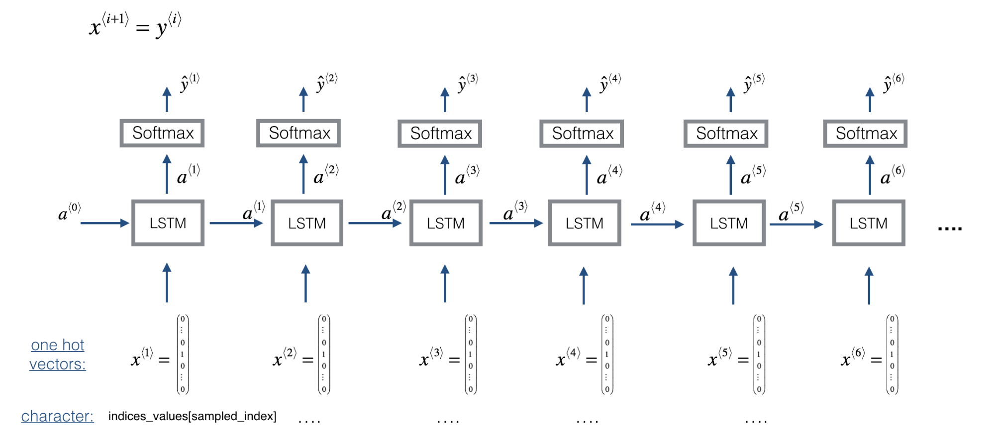
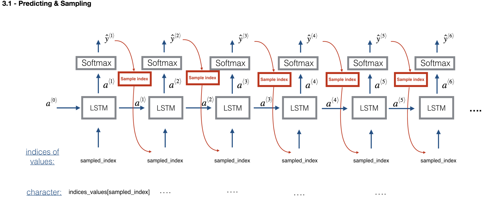

## Improvise a Jazz Solo with an LSTM Network  

### Objectives 
* Apply an LSTM to music generation.
* Generate your own jazz music with deep learning.

### Notes
* A sequence model can be used to generate musical values, which are then post-processed into midi music.
* Fairly similar models can be used to generate dinosaur names or to generate music, with the major difference being the input fed to the model.
* In Keras, sequence generation involves defining layers with shared weights, which are then repeated for the different time steps  1,…,Tx. 

### Common Practice 
* __RNN training__: 
  
* __RNN sampling__: 
  

