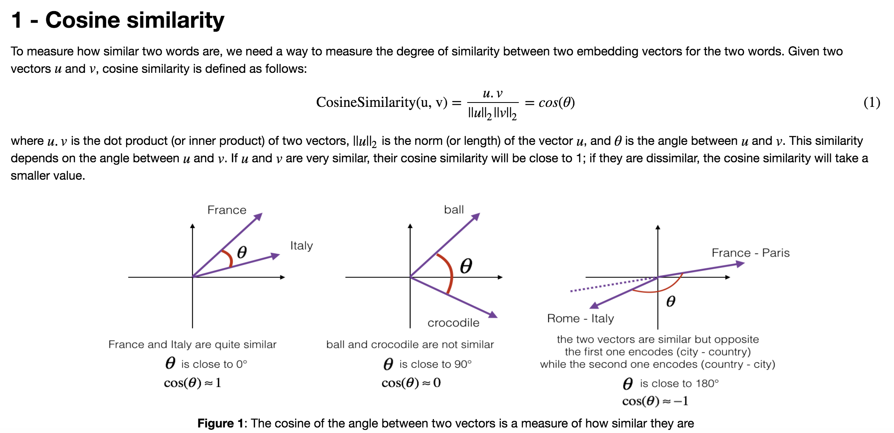

## Operations on word vectors 

### Objectives 
* Load pre-trained word vectors, and measure similarity using cosine similarity. 
* Use word embeddings to solve word analogy problems such as Man is to Woman as King is to __.
* Modify word embeddings to reduce their gender bias. 

### Notes 
* Cosine similarity a good way to compare similarity between pairs of word vectors. (Though L2 distance works too.)
* For NLP applications, using a pre-trained set of word vectors from the internet is often a good way to get started.  

### Common Practice 
* __Cosine Similarity__  

