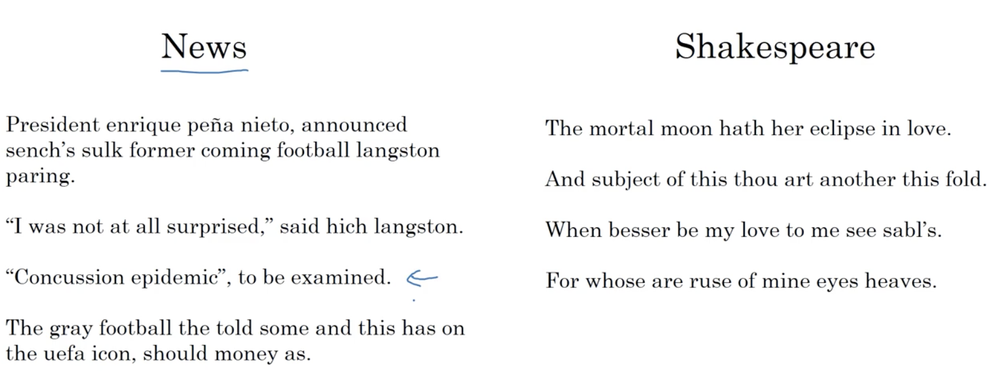
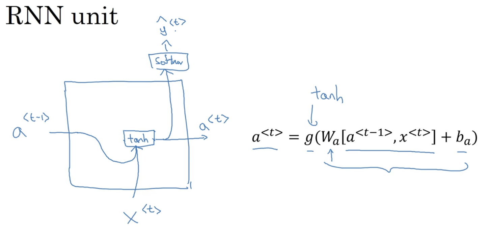
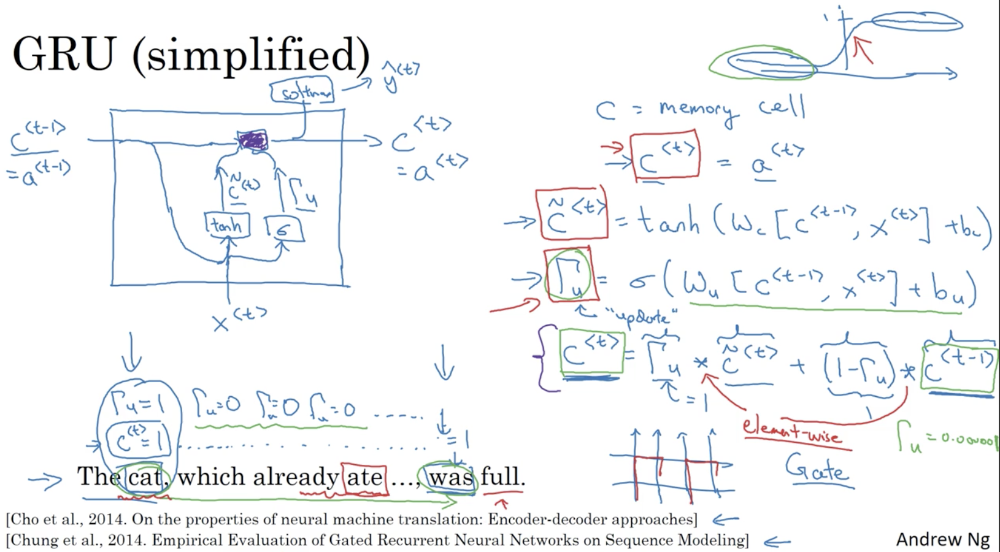
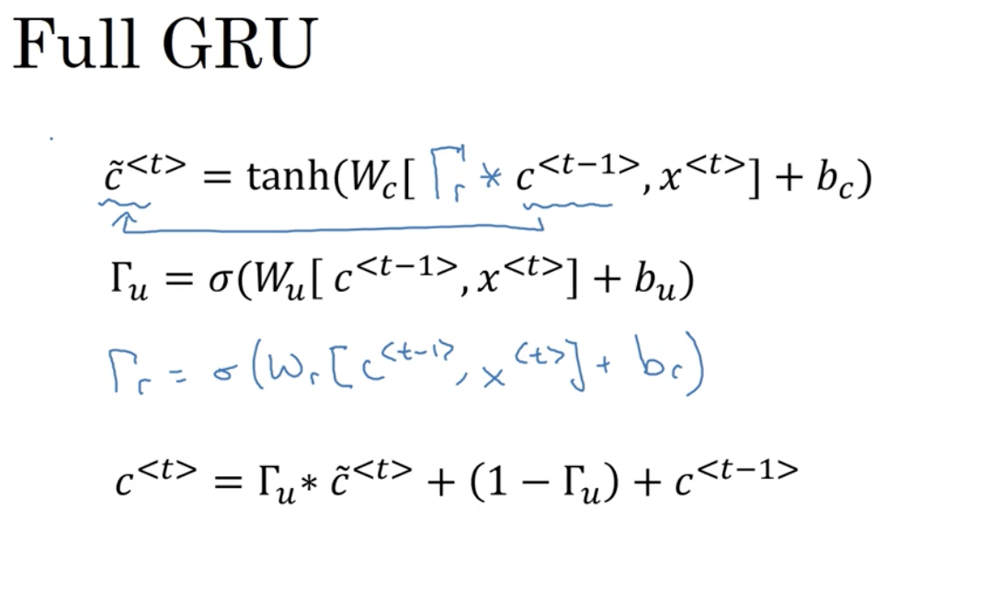
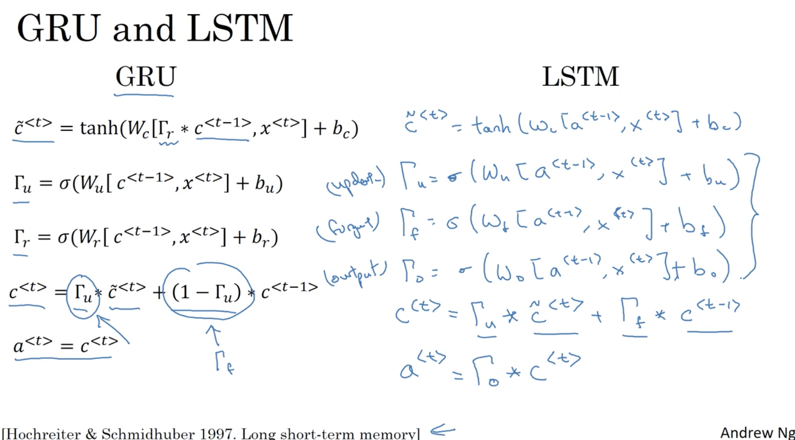
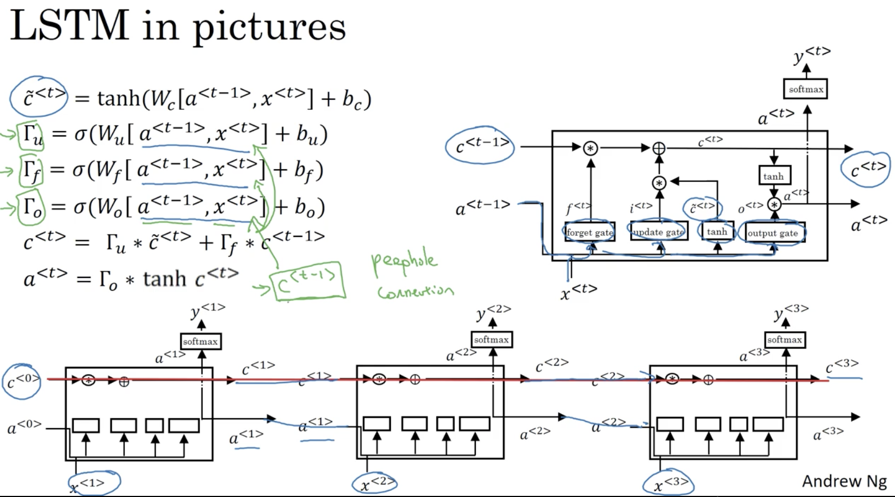
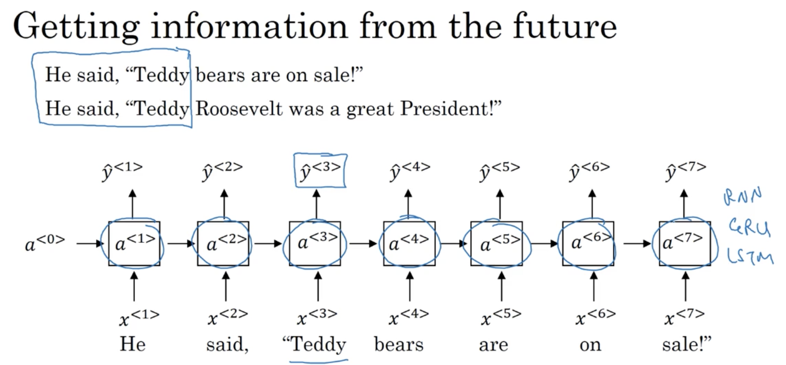
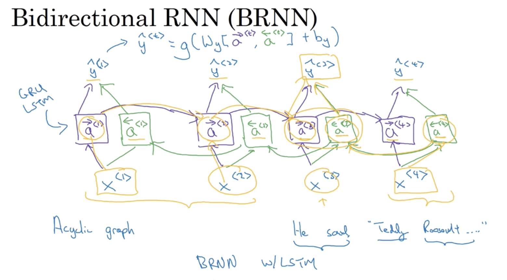
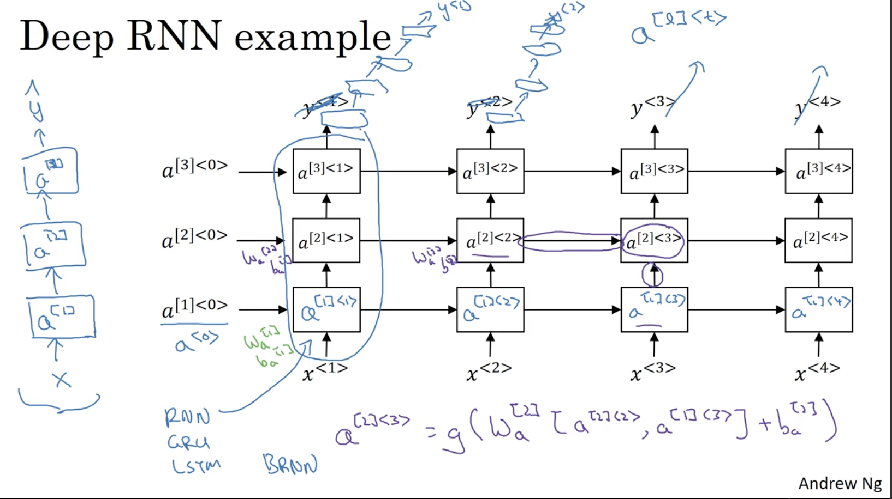

# Recurrent Neural Networks 

## Learning Objectives 
* Learn about recurrent neural networks. This type of model has been proven to perform extremely well on temporal data. It has several variants including LSTMs, GRUs and Bidirectional RNNs, which you are going to learn about in this section. 

### 1. Sequence Models
* examples of sequence data 
    

### 2. Sequence Model Notation 
* motivating example: recognise name entities in the passage. 
  
_`<t>` means the t-th element in a sequence & `T` means the length of a sequence._
* build a vocabulary to represent words in a mapping  
  
_one-hot representation_

### 3. Recurrent Neural Network Model 
* why a standard neural network did not work well? 
  
_note that also RNN will reduce the number of parameters in the NN model._  
* a brief look into the RNN:  
  
_limitation: only uses information from previous elements in the sequence but not  those subsequent elements._  
* calculations in forward propagation in the RNN model: 
  
 
_W & b parameters are shared in the RNN across different layers._ 
* Backpropagation through time: performs calculations in the opposite directions than forward propagation    
  
* loss function is similar to binary classification for logistic regression: cross-entropy loss. 

### 4. Different RNN Architectures 
* the reason why we need different types of RNNs due to the fact that Tx might not be equal to Ty. 
* __different types of RNN__
	* many-to-many (Tx = Ty)  
	  
	* many-to-many (Tx != Ty)  
	  
	* many-to-one  
	  
	* one-to-many  
	  
	* one-to-one 
	  
* summary of RNN types 
  

### 5. Language Model and Sequence Generation 
* speech recognition: find the probability of that sentence out there.  
  
* Modelling an RNN
  
  

### 6. Sampling Novel Sequences 
* sampling from y_hat prediction distributions and feeding it to the next node in the sequence. 
  
* you could also build a character-level model  
  
_adv: handle Unknown words; disavd: much longer sequences, computational expensive, unable to capture sentence semantics._ 
* examples of sequence generation 
  

### 7. Vanishing Gradients with RNNs 
* challenge: language could potentially have long-term dependencies but RNN are not good at capturing this relation.  
  
_exploding gradients is handled by gradient clipping (i.e. rescaling some layers' gradients)._  

### 8. Gated Recurrent Unit (GRU) 
* it helps a lot to the vanishing gradient problem and captures long-term relations better. 
  
* simplified GRU  
  
_Note: a) intuitively a bit is used to memorised some feature for the long run, so no vanishing gradients concern. b) variables in the red can ve vectors, which means potentially one for each layer. c) gemma u means update unit. d) purple ares match._ 
* Full GRU  
  
_Note: new variable gemma r is used to measure the relevance between c^t-1  and c^t._  

### 9. Long Short Term Momery (LSTM)  
* GRU vs. LSTM  
  
* LSTM diagrams  
  
* LSTM is probably the default. 

### 10. Bidirectional RNN (BRNN)  
* forward-directional only RNN cannot gain info from the future (later in the sequence). 
  
* BRNN 
  
* __disadv__: you will need the entire sequence of data to make predictions. 

### 11. Deep RNN 
* introduce the idea of layers. Usually not very deep in terms of layers, but can have multiple horizontally-independent layers.    
  

