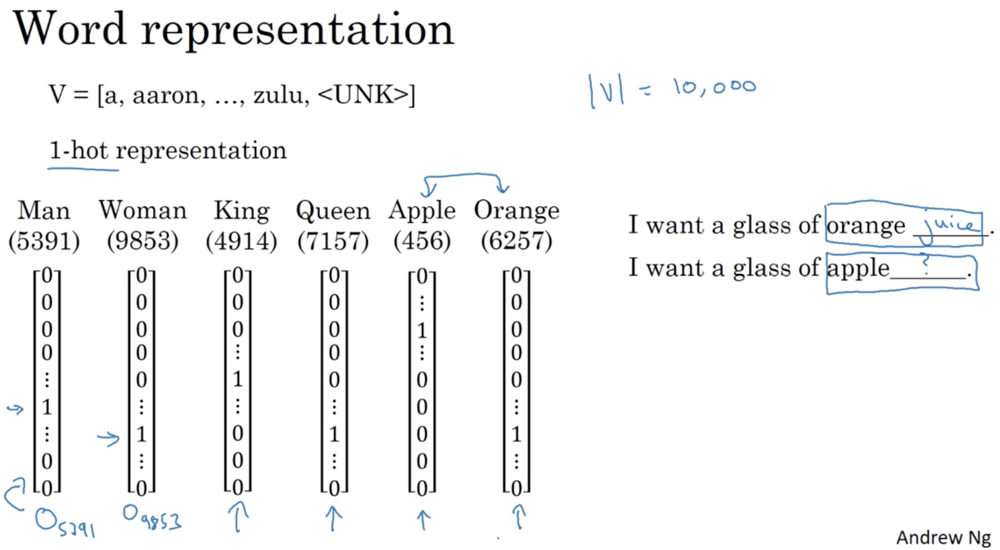
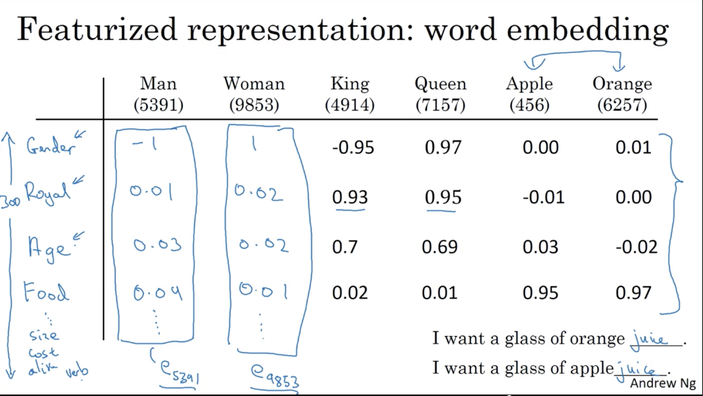
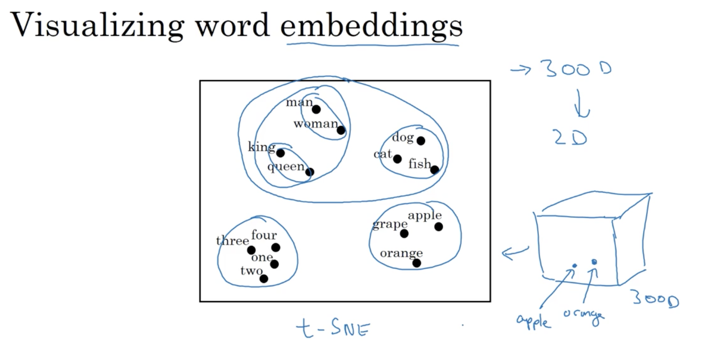
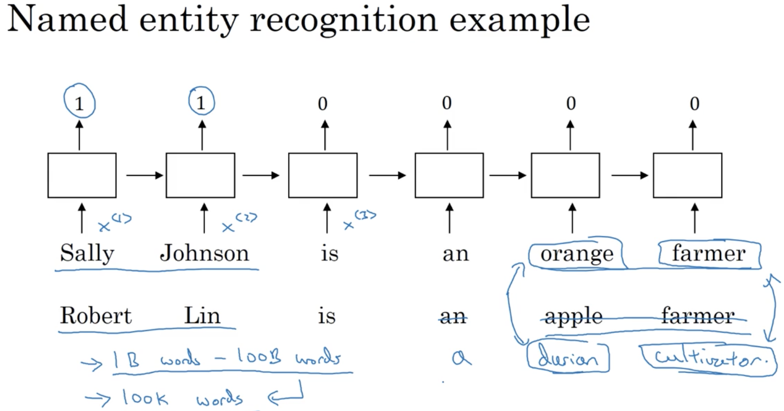
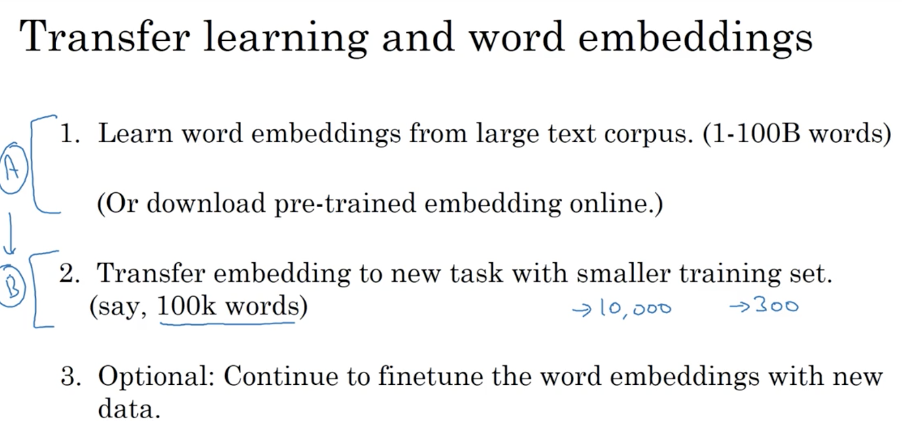
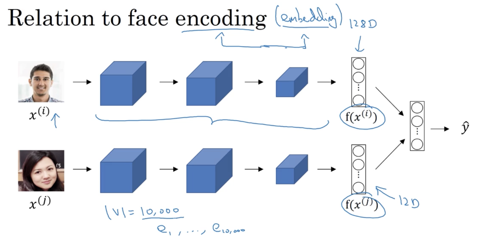
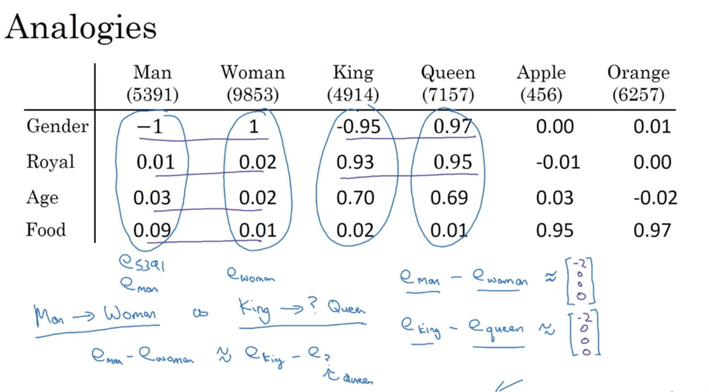
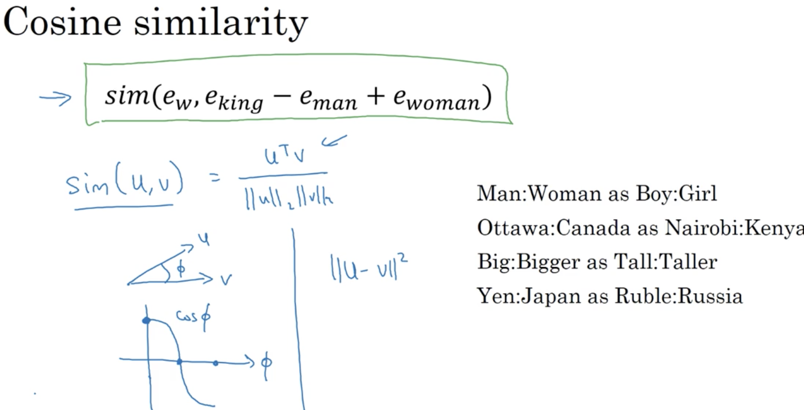
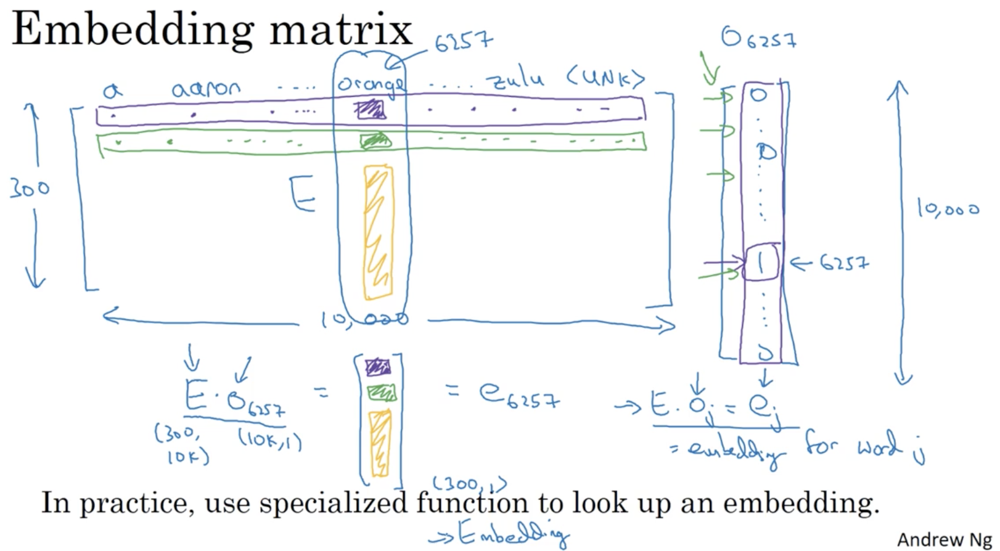

# Natural Language Processing & Word Embeddings 

## Learning Objectives 
* Natural language processing with deep learning is an important combination. Using word vector representations and embedding layers you can train recurrent neural networks with outstanding performances in a wide variety of industries. Examples of applications are sentiment analysis, named entity recognition and machine translation.

### 1. Word Representation
* 1-hot representation 
  
_disadv: treats each word as a thing onto itself and it doesn't allow algorithm to easily generalize across words. No idea how similar between words since the inner product is always 0._  
* Featurized representation: word embedding 
  
* 	the feature vector learned might be hard to figure out the exact meaning, but will allow algorithm to determine the similarity between words. 
* visualizing feature vector on lower dimensions  
  

### 2. Word embeddings 
* name entity recognition  
  
* transfer learning for word embeddings 
  
* related to face encoding  
  
_word embedding is mostly for a fixed set of words._  
* word embeddings can help figure out analogies as follows (i.e. analogy reasoning)  
  
  
_note that sim calculation should be performed on the original multi-dimensional space._  
* common similarity functions 
  
* embedding matrix 
  

### 3. Learning Word Embeddings 
