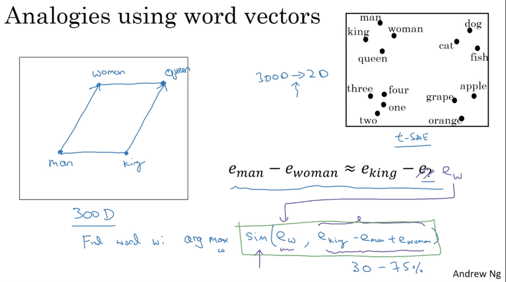

# Natural Language Processing & Word Embeddings 

## Learning Objectives 
* Natural language processing with deep learning is an important combination. Using word vector representations and embedding layers you can train recurrent neural networks with outstanding performances in a wide variety of industries. Examples of applications are sentiment analysis, named entity recognition and machine translation.

### 1. Word Representation
* 1-hot representation 
  
_disadv: treats each word as a thing onto itself and it doesn't allow algorithm to easily generalize across words. No idea how similar between words since the inner product is always 0._  
* Featurized representation: word embedding 
  
* 	the feature vector learned might be hard to figure out the exact meaning, but will allow algorithm to determine the similarity between words. 
* visualizing feature vector on lower dimensions  
  

### 2. Word embeddings 
* name entity recognition  
  
* transfer learning for word embeddings 
  
* related to face encoding  
  
_word embedding is mostly for a fixed set of words._  
* word embeddings can help figure out analogies as follows (i.e. analogy reasoning)  
  
  
_note that sim calculation should be performed on the original multi-dimensional space._  
* common similarity functions 
  
* embedding matrix 
  

### 3. Learning Word Embeddings 
* __neural language model: predicting missing words.__ 
  
  
_If you want to build a language model then using last 4 words as context is a good approach. If you want to learn the word embeddings, all contexts suffice._  
* __Word2Vec: constructing context/target pairs within a window for supervised learning.__  
  
  
_disadv: computational expensive when calculating the probability of p(t|c) - the softmax._  
  
_when sampling context words, normally use a distribution with heuristics to avoid frequently sampling stopwords._  
* __Negative Sampling: given a pair of words, determine whether this is a pair of context-target (associating) pair as a supervised learning task.__ 
    
	* generating training examples:  
	* a) positive examples: pick a context word and then a target word within some range.
	* b) negative examples: pick the same context word and randomly pick words from the dictionary.  
  
* sampling distribution  
  
_sampling distribution is between uniform and frequency._  
* __GloVe word vectors (global vectors for word representation): couting the number of time word t appears within the context of word c.__  
  
_note that depending on the definition of the context, X matrix might be symmetrical diagonally._  
  
_the weighting term function has the following functionalities: a) eliminating 0-count terms, b) giving slightly less weights to stopwords pairs, c) moderating less frequent word pairs._
* axis might not be easily human-interpretable and might not be orthogonal.  
  

### 4. Sentiment Classification 
* classifying the emotion of a piece of text.  

* challenge: might not have a huge labelled training set. 
* __Simple Sentiment Classification Model__  
  
_disadv: the average function might turn bad reviews into good ones (indicated at the left-bottom corner)._ 
* __RNN for sentiment classification__  
  

### 5. Debiasing Word Embeddings
* aim: free of all forms of bias (e.g. gender bias).  
  
* how to address bias?  
  

