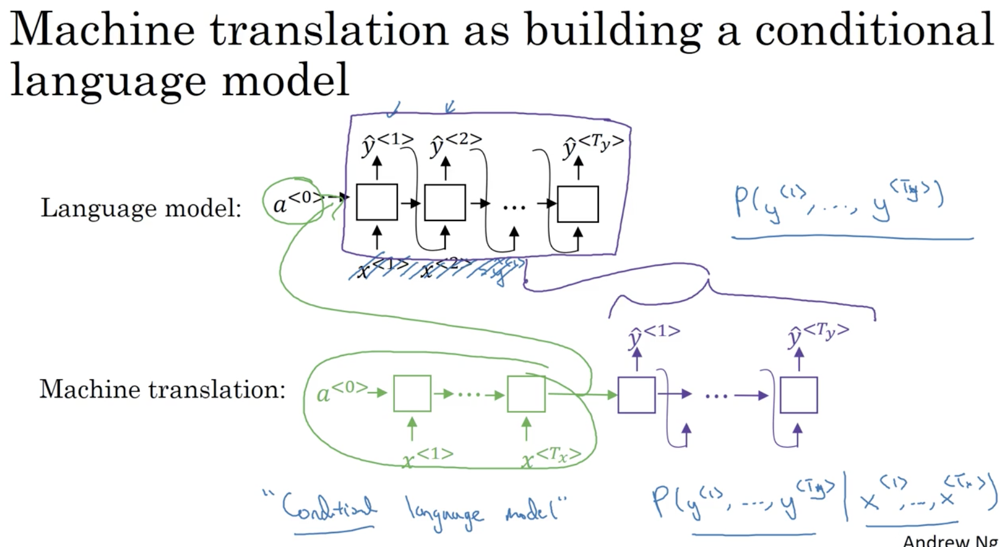
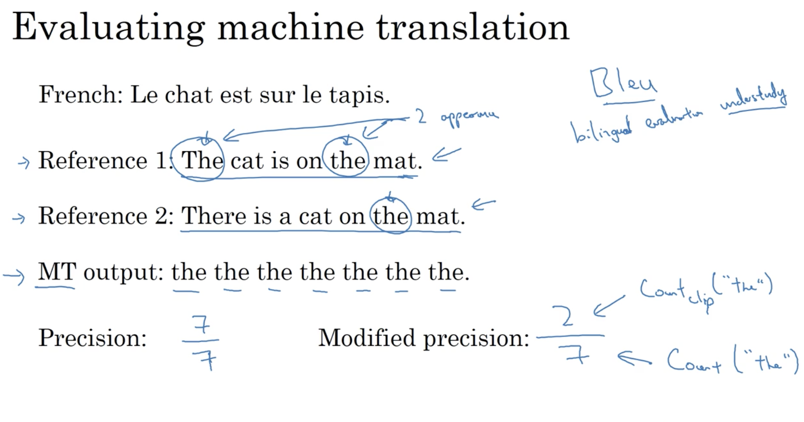

# Sequence models & Attention mechanism  

## Learning Objectives 
* Sequence models can be augmented using an attention mechanism. This algorithm will help your model understand where it should focus its attention given a sequence of inputs. This week, you will also learn about speech recognition and how to deal with audio data.  

### 1. Sequence to Sequence Model 
* use a encoder & a decoder  
  
* image captioning would use a similar model  
  

### 2. Picking the Most Likely Sentence 
* Conditional Language Model  
  
* don't ramdomly sample the words for translation, choose the sentence that maximises the probability  
  
* why not greedy search? - not good enough (might not be optimal)
  

### 3. Beam Search 
* Beam Width: the number of words/sequences considered in each step in terms of the joint probability of p(y1, y2, .. yn | X) where n = 1 .. Ty. 
  
  
  
_if the beam width == 1, then it will just be greedy search._  
* __log transformation__: the product of probabilities can be extremely small. 
* __length normalization__: make sure probability measurement doesn't prefer shorter sentences. 
  
  

### 4. Error Analysis in Beam Search 
* which one to blame? RNN or Beam Search? 
  
* analysis on Beam Search 
  
  

### 5. _Bleu_ Score 
* bleu score: whether any of the words generated by the machine is in the human translation set and how many. 
* modified precision: has a clip on the number of valid counts is capped at the max number of appearance in one of the reference sentence. 
 
* we would also like to look at pairs of words.  
  
  
* the final bleu score 
 

### 6. Attention Model 
* the blue line is the basic seq to seq model while the green line is the attention model. 
 
* introducing attention weights alpha. This allows for a weighted window to be considered for each translation step:    
  
* 